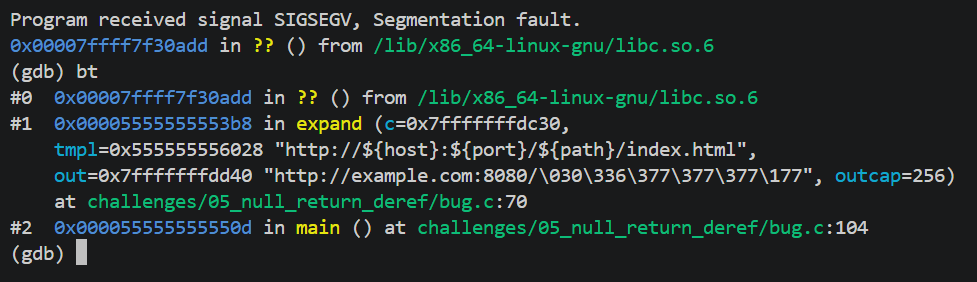
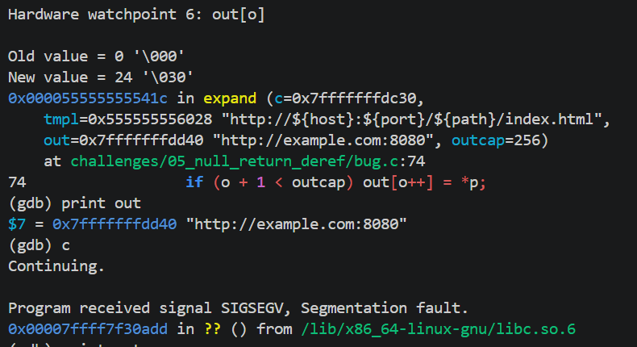
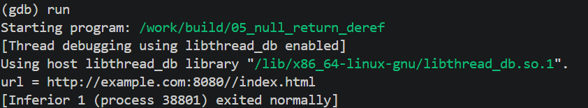

<!-- generated from vault: 05_null_return_deref 코드 분석.md — 편집은 Obsidian에서 -->
---
분류: 코드 분석
버그유형: 
언어: C
출처: 
날짜: 2026-09-19
---

# 05_null_return_deref 코드 분석

한 줄 시나리오: `key=value 설정 저장소(Config)와, "${key}" 자리표시자를 실제 값으로 치환하는 템플릿 확장기 expand() 를 만든다. 예: "http://${host}:${port}/${path}".`

> 증상: (어디서 어떤 신호로 죽는가) · 원인: (어느 함수의 무엇이 잘못됐는가)


## 구조체

Config - 설정 저장소
```C
#define MAX_KV 16

typedef struct {
    const char *keys[MAX_KV];
    const char *vals[MAX_KV];
    int n;
} Config;
```
- `keys` - 자리 표시자를 찾을 때 사용
	- 주어진 템플릿의 자리 표시자를 찾아서 저장된 값으로 치환하기 위해 사용된다.
- `vals` - 해당 자리표시자를 치환할 값
	- `keys`를 통해 찾은 자리표시자에 자리표시자를 지우고 저장된 `vals`로 값을 치환한다.
- `n` - 각 key와 value의 개수수


## 함수

### 종류별 동작
```C
static void cfg_set(Config *c, const char *k, const char *v) {
    if (c->n < MAX_KV) { c->keys[c->n] = k; c->vals[c->n] = v; c->n++; }
}

static const char *cfg_get(const Config *c, const char *k) {
    for (int i = 0; i < c->n; i++)
        if (strcmp(c->keys[i], k) == 0) return c->vals[i];
    return NULL;                         /* 없는 키 → NULL */
}
```
- `cfg_set()` - 해당 Config에 k와 v값을 추가
- `cfg_get()` - 해당 Config에 k값으로 v값 찾기

### 핵심 로직
```C
static void expand(const Config *c, const char *tmpl, char *out, size_t outcap) {
    size_t o = 0;
    for (const char *p = tmpl; *p; ) {
        if (p[0] == '$' && p[1] == '{') { // 템플릿에서 key값(자리표시자) 추출
            const char *end = strchr(p, '}');
            if (!end) break;
            char key[32];
            size_t kl = (size_t)(end - (p + 2));
            if (kl >= sizeof key) kl = sizeof key - 1;
            memcpy(key, p + 2, kl);
            key[kl] = '\0';
  
            // 해당 key값으로 val값 치환
            const char *v = cfg_get(c, key);      
            size_t vl = strlen(v);                 
            if (o + vl < outcap) { memcpy(out + o, v, vl); o += vl; }
            p = end + 1;
        } else {
            if (o + 1 < outcap) out[o++] = *p;
            p++;
        }
    }
    out[o] = '\0';
}
```
- `expand` - 받아온 템플릿(`tmpl`)을 저장된 설정(`Config`)으로 치환
	- 매개변수
		- `Config *c` - 저장된 설정
		- `char *tmpl` - 치환 전 템플릿
		- `char *out` - 치환 후 템플릿
		- `size_t outcap` - 치환 후 템플릿의 최대 길이
	- 동작
		- 템플릿에서 "${", "}"이 부분들의 위치 추적
			- 해당 위치의 값을 key에 저장 후, 후처리('\0')
			- 저장된 설정(c)에서 해당 key값으로 val값 치환
		- 아니라면 해당 위치에 맞는 템플릿 값 `out`에 저장
		- 마지막 후처리

### 메인 함수
```C
int main(void) {
    Config cfg = { .n = 0 };
    cfg_set(&cfg, "host", "example.com");
    cfg_set(&cfg, "port", "8080");
    
    const char *tmpl = "http://${host}:${port}/${path}/index.html";
    char out[256];
  
    expand(&cfg, tmpl, out, sizeof out);   /* ${path} 치환 시 NULL 역참조 → 크래시 */
  
    printf("url = %s\n", out);
    return 0;
}
```

실행 흐름
1. 설정 초기화
2.  템플릿 초기화 
3.  `expand()`로 템플릿 확장 **← 원인 지점**: path라는 key값은 없음
4.  `*v`에 NULL이 저장되며 strlen(NULL), memcpy(out+o, NULL, vl)에 NULL을 역참조하며 SIGSEGV오류 발생




## gdb로 잡기

빌드: `make gdb NAME=` (= `gdb ./build/`)

### 1) 죽은 자리 — `run` → `bt`
```
(gdb) run
0x00007ffff7f30add in ?? () from /lib/x86_64-linux-gnu/libc.so.6

(gdb) bt
#0  0x00007ffff7f30add in ?? () from /lib/x86_64-linux-gnu/libc.so.6
#1  0x00005555555553b8 in expand (c=0x7fffffffdc30,
    tmpl=0x555555556028 "http://${host}:${port}/${path}/index.html",
    out=0x7fffffffdd40 "http://example.com:8080/\030\336\377\377\377\177", outcap=256)
    at challenges/05_null_return_deref/bug.c:70
#2  0x000055555555550d in main () at challenges/05_null_return_deref/bug.c:104
```
`expand()`에서 host와 port까지는 잘 변경되었지만 path부분을 넘겨받지 않아 쓰레기값으로 채워졌다. 할당되지 않은 메모리에 접근하여 SIGSEGV오류가 반환되어 프로그램이 종료되었다.

### 2) 어떤 데이터인지 — `key`, `*v`, `out`
```
(gdb) print key
$1 = "path\000\177\000\000\247?\377\367\377\177\000\000\r\000\000\000\000\000\000\000\031`UUUU\000"

(gdb) print v
$2 = 0x0
(gdb) print *v
Cannot access memory at address 0x0

(gdb) print out
$4 = 0x7fffffffdd40 "http://example.com:8080/\030\336\377\377\377\177"
```
(해석 — 기대값 vs 실제값)
key가 Config에 없을때는 NULL에 대한 처리를 해야한다.
key는 path라는 값이 Config에 없어서 이상한 쓰레기 값이 들어간다.

### 3) 누가 언제 그렇게 만들었는지 — `break`, `watch`
```
(gdb) break expand
```
(해석)

${port}까지는 정확하게 동작했지만 ${path}부터 문제가 생겼다.

### 정리
| 단계  | 함수     | 무슨 일    |
| --- | ------ | ------- |
| 원인  | expand | NULL처리  |
| 증상  |        | SIGSEGV |


## 문제
- 존재하지 않는 key값으로 vals를 찾으려고하면 NULL을 반환하는데 해당 NULL에 대한 처리가 없다.

**결론 한 문장:** NULL에 대한 기본값 처리


## 수정
- 왜 이 위치에서 고치는가 (책임/소유권): expand에서 Config에 대한 정보를 가지고 있고 `out`에 대한 수정을 책임져야한다.

- 무엇을 바꾸는가: 해당 key값이 없다면 기본값으로 변환환


정답 코드
```C
#include <stdio.h>
#include <stdlib.h>
#include <string.h>
  

#define MAX_KV 16
typedef struct {
    const char *keys[MAX_KV];
    const char *vals[MAX_KV];
    int n;
} Config;
  
static void cfg_set(Config *c, const char *k, const char *v) {
    if (c->n < MAX_KV) { c->keys[c->n] = k; c->vals[c->n] = v; c->n++; }
}
  
static const char *cfg_get(const Config *c, const char *k) {
    for (int i = 0; i < c->n; i++)
        if (strcmp(c->keys[i], k) == 0) return c->vals[i];
    return NULL;                         /* 없는 키 → NULL */
}


static void expand(const Config *c, const char *tmpl, char *out, size_t outcap) {
    size_t o = 0;
    for (const char *p = tmpl; *p; ) {
        if (p[0] == '$' && p[1] == '{') {
            // 템플릿에서 key값(자리표시자) 추출
            const char *end = strchr(p, '}');
            if (!end) break;
            char key[32];
            size_t kl = (size_t)(end - (p + 2));
            if (kl >= sizeof key) kl = sizeof key - 1;
            memcpy(key, p + 2, kl);
            key[kl] = '\0';

            // 해당 key값으로 val값 치환
            const char *v = cfg_get(c, key);
            if (v == NULL) v = "";          // NULL이면 ""(기본값)으로
            size_t vl = strlen(v);                 
            if (o + vl < outcap) { memcpy(out + o, v, vl); o += vl; }
            p = end + 1;
        } else {
            if (o + 1 < outcap) out[o++] = *p;
            p++;
        }
    }
    out[o] = '\0';
}

int main(void) {
    Config cfg = { .n = 0 };
    cfg_set(&cfg, "host", "example.com");
    cfg_set(&cfg, "port", "8080");


    const char *tmpl = "http://${host}:${port}/${path}/index.html";
    char out[256];
  
    expand(&cfg, tmpl, out, sizeof out);   /* ${path} 치환 시 NULL 역참조 → 크래시 */
  
    printf("url = %s\n", out);
    return 0;
}
```

검증: 종료 코드 · 기대 출력 일치 여부 · valgrind / ASan 결과


