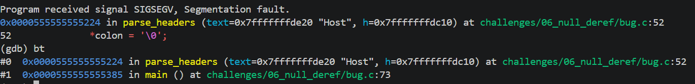

<!-- generated from vault: 06_null_deref 코드 분석.md — 편집은 Obsidian에서 -->
---
분류: 코드 분석
버그유형: 
언어: C
출처: 
날짜: 2026-09-19
---

# 06_null_deref 코드 분석

한 줄 시나리오: "Key: Value" 형식의 헤더 블록을 줄 단위로 파싱한다. 각 줄에서 ':' 를 찾아 그 자리를 '\0' 로 끊어 key/value 로 나눈 뒤 목록에 저장한다.

> 증상: (어디서 어떤 신호로 죽는가) · 원인: (어느 함수의 무엇이 잘못됐는가)


## 구조체

Header
```C
#define MAX_HEADERS 32

typedef struct {
    char *keys[MAX_HEADERS];
    char *vals[MAX_HEADERS];
    int   count;
} Headers;
```
- `keys` - 헤더의 key 값 저장
- `vals` - 헤더의 value값 저장
- `count` - 헤더의 개수


## 함수
### 핵심 로직
```C
static void parse_headers(char *text, Headers *h) {
    for (char *line = strtok(text, "\n"); line != NULL; line = strtok(NULL, "\n")) {
        char *colon = strchr(line, ':');  
  
        *colon = '\0';                    
        char *key = line;
        char *val = skip_ws(colon + 1);
  
        if (h->count < MAX_HEADERS) {
            h->keys[h->count] = key;
            h->vals[h->count] = val;
            h->count++;
        }
    }
}
```
- `parse_headers()` - parse안된 텍스트들을 받아와서 `Headers *h`에 parse후 저장
	- `char *strtok(const char *s, const char *delim)` - `s`를 구분자 집합 `delim`으로 잘라 토큰을 하나씩 반환, 더 없으면 `NULL`
	- `char *strchr(const char *s, int c)` - `s`에서 문자 `c`가 **처음** 나오는 위치, 위치 포인터가 없으면 `NULL`

### 기타 (재현 장치·유틸)
```C
static char *skip_ws(char *s) {
    while (*s == ' ' || *s == '\t') s++;
    return s;
}
```
- `static char *skip_ws(char *s)` - 띄어쓰기 혹은 \tab 넘기기

### 메인 함수
```C
int main(void) {
    char raw[] =
        "Host: example.com\n"
        "Accept: */*\n"
        "Connection\n"                    
        "User-Agent: memdbg-cli\n";
  
    Headers h = { .count = 0 };
    parse_headers(raw, &h);                
  
    printf("parsed %d headers\n", h.count);
    for (int i = 0; i < h.count; i++)
        printf("  %s = %s\n", h.keys[i], h.vals[i]);
    return 0;
}
```

실행 흐름
1. 파싱되지 않은 raw값 초기화
2. 헤더를 저장할 `Headers h` 선언 및 초기화
3. `parse_headers(raw, &h)` - 헤더 파싱 **← 원인 지점**: SIGSEGV



## gdb로 잡기

빌드: `make gdb NAME=` (= `gdb ./build/`)

### 1) 죽은 자리 — `run`, `bt`
```
(gdb) run
Program received signal SIGSEGV, Segmentation fault.
0x0000555555555224 in parse_headers (text=0x7fffffffde20 "Host", h=0x7fffffffdc10) at challenges/06_null_deref/bug.c:52

(gdb) bt
#0  0x0000555555555224 in parse_headers (text=0x7fffffffde20 "Host", h=0x7fffffffdc10) at challenges/06_null_deref/bug.c:52
#1  0x0000555555555385 in main () at challenges/06_null_deref/bug.c:73

```
SIGSEGV오류, `*colon = '\0'`부분에서 발생생

### 2) 어떤 데이터인지 — `print`
```
(gdb) print line
$7 = 0x7fffffffde3e "Connection"
(gdb) print colon
$8 = 0x0
```
현재 `colon`이 `NULL`이고 `*colon`으로 `NULL`을 역참조해서 SIGSEGV오류 발생

### 3) 누가 언제 그렇게 만들었는지 — `break`, `watch`
```
(gdb) break parse_headers
(gdb) run

(gdb) print line
$1 = 0x7fffffffde20 "Host: example.com"
(gdb) print colon
$2 = 0x7fffffffde24 ": example.com"

(gdb) print line
$3 = 0x7fffffffde32 "Accept: */*"
(gdb) print colon
$4 = 0x7fffffffde24 ""

(gdb) print line
$5 = 0x7fffffffde3e "Connection"
(gdb) print colon
$6 = 0x0
```
`strchr(line, ':')` - 에서 `line`이 :(콜론)이 없어서 NULL 반환
-> `colon`이 NULL이 된다. 해당 NULL처리의 부재로 SIGSEGV오류 발생생

### 정리
| 단계  | 함수                                      | 무슨 일        |
| --- | --------------------------------------- | ----------- |
| 원인  | `parse_headers(char *text, Headers *h)` | NULL 검사를 안함 |
| 전파  | `strchr`                                | NULL반환      |
| 증상  | `*colon = '\0'`                         | NULL역참조     |


## 문제
- `line`에 `:`(콜론)이 없을 때, `colon`변수가 `NULL`이 된다.
- `*colon = '\0'`에서 `NULL`역참조가 일어나 SIGSEGV오류 발생

**결론 한 문장:** `colon`이 `NULL`일 때, 처리 필요


## 수정
- 무엇을 바꾸는가: `colon`이 NULL이면 건너뛰기


정답 코드
```C
#include <stdio.h>
#include <stdlib.h>
#include <string.h>
  
#define MAX_HEADERS 32
typedef struct {
    char *keys[MAX_HEADERS];
    char *vals[MAX_HEADERS];
    int   count;
} Headers;
  
static char *skip_ws(char *s) {
    while (*s == ' ' || *s == '\t') s++;
    return s;
}

  
static void parse_headers(char *text, Headers *h) {
    for (char *line = strtok(text, "\n"); line != NULL; line = strtok(NULL, "\n")) {
        char *colon = strchr(line, ':');  

        if (!colon) continue;           // colon이 NULL일 때, 건너뛰기
  
        *colon = '\0';                    
        char *key = line;
        char *val = skip_ws(colon + 1);
  
        if (h->count < MAX_HEADERS) {
            h->keys[h->count] = key;
            h->vals[h->count] = val;
            h->count++;
        }
    }
}

  
int main(void) {
  
    char raw[] =
        "Host: example.com\n"
        "Accept: */*\n"
        "Connection\n"                    
        "User-Agent: memdbg-cli\n";
  
    Headers h = { .count = 0 };
    parse_headers(raw, &h);                
  
    printf("parsed %d headers\n", h.count);
    for (int i = 0; i < h.count; i++)
        printf("  %s = %s\n", h.keys[i], h.vals[i]);
    return 0;
}
```

검증: 종료 코드 · 기대 출력 일치 여부 · valgrind / ASan 결과


---
<!-- 📋 사용법
     - "증상"과 "원인"의 위치가 다르면 실행 흐름에 둘 다 표시한다 (이게 핵심)
     - gdb 출력은 실제로 찍은 걸 붙이고, 각 블록 아래에 "이 값이 왜 이상한지" 한 줄
     - 정답 코드에서 바꾼 줄에는 // 원래 없었음 / // ← 이유 를 남긴다
     - 검증은 크래시 안 남 + 기대 출력 + valgrind 세 가지를 다 적는다
     - 관련 노트: GDB Cheat Sheet
-->
