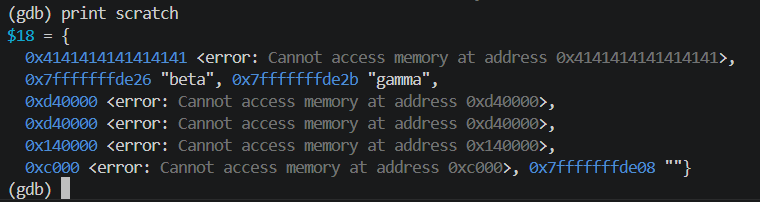

<!-- generated from vault: 07_stack_use_after_return 코드 분석.md — 편집은 Obsidian에서 -->
---
분류: 코드 분석
버그유형: 
언어: C
출처: 
날짜: 2026-09-21
---

# 07_stack_use_after_return

한 줄 시나리오:  문자열을 줄 단위로 쪼개, 각 줄의 시작 주소들을 담은 "뷰(LineView)"를 만든다. split_lines() 가 만든 뷰를 호출자가 받아서 출력한다.

> 증상: `checksum += (unsigned char)v.lines[i][0];`에서 SIGSEGV 
> 원인: `static void split_lines(LineView *out, char *text)`


## 구조체

LineView
```C
#define MAX_LINES 8
typedef struct {
    char **lines;    /* 줄 포인터들의 '배열'을 가리킨다 */
    int count;
} LineView;
```
- `**lines` - `line` 배열을 가리키는 포인터
- `count` - `line`의 개수


## 함수

### 핵심 로직
```C  
static void split_lines(LineView *out, char *text) {
    char *parts[MAX_LINES];              
    int n = 0;
    /* strtok는 새로 할당하지 않고, 넘겨받은 문자열 내부의 주소를 돌려준다.
    * 따라서, strtok은 원본 버퍼를 제자리에서 수정한다.
    */
    for (char *ln = strtok(text, "\n"); ln && n < MAX_LINES; ln = strtok(NULL, "\n"))
        parts[n++] = ln;
  
    view_set(out, parts, n);      
  
    /* TODO 상기 코드를 수정하여 결과를 호출자가 준 out 에 직접 채운다(값 반환 아님, 지역 주소 반환 아님). */      
}

/* 결과를 뷰에 채운다(포인터를 함수 경계 너머로 옮겨 -Wdangling 을 회피하는 형태) */
static void view_set(LineView *out, char **arr, int n) {
    out->lines = arr;
    out->count = n;
}
```
- `static void split_lines(LineView *out, char *text)` - `*text`를 `'\n'`기준으로 나누어 `*parts[]`에  넣고 `view_set()`으로 `LineView *out`에 채운다.
- `static void view_set(LineView *out, char **arr, int n)` - 받은 `**arr`로 `out`을 채운다.

### 기타 (재현 장치·유틸)
```C
/* split_lines 가 쓰던 스택 프레임을, 같은 모양(char*[8])의 지역 배열로 덮는다.
   무효가 된 parts[] 자리에 '그럴듯한 쓰레기 포인터'가 들어차게 만든다. */
static void warm_stack(void) {
    char *scratch[MAX_LINES];
    for (int i = 0; i < MAX_LINES; i++)
        scratch[i] = (char *)0x4141414141414141ULL;   /* 매핑되지 않은 주소 */
    __asm__ volatile("" :: "r"(scratch) : "memory");   /* 최적화 제거 방지 */
}
```
- `warm_stack()` -  기존에 있던 포인터 배열에 쓰레기 포인터들을 넣는다.
### 메인 함수
```C
int main(void) {
    char text[] = "alpha\nbeta\ngamma";
  
    LineView v;
    split_lines(&v, text);              
    warm_stack();                        
  
    long checksum = 0;
    for (int i = 0; i < v.count; i++)
        checksum += (unsigned char)v.lines[i][0];
  
    printf("lines = %d, checksum = %ld\n", v.count, checksum);
    return 0;
}
```

실행 흐름
1.  `text` 초기화
2.  `for (char *ln = strtok(text, "\n"); ln && n < MAX_LINES; ln = strtok(NULL, "\n")) parts[n++] = ln;` **← 원인 지점**: `parts`가 함수가 끝나면 스택프레임이 무효가 됨
3.  `checksum += (unsigned char)v.lines[i][0];` **← 실제 크래시 지점**: SIGSEGV


## gdb로 잡기

빌드: `make gdb NAME=` (= `gdb ./build/`)

### 1) 죽은 자리 — `run` -> `bt`
```
(gdb) r
Program received signal SIGSEGV, Segmentation fault.
main () at challenges/07_stack_use_after_return/bug.c:93
93              checksum += (unsigned char)v.lines[i][0];
(gdb) bt
#0  main () at challenges/07_stack_use_after_return/bug.c:93

```
`v.lines[0]`은 유효하지 않은 메모리를 `[0]`으로 역참조

### 2) 어떤 데이터인지 — `print`, `print *`, `info locals`
```
(gdb) print v.lines[0]
$1 = 0x4141414141414141 <error: Cannot access memory at address 0x4141414141414141>
(gdb) print v.lines[1]
$2 = 0x4141414141414141 <error: Cannot access memory at address 0x4141414141414141>
(gdb) print v.lines[2]
$3 = 0x4141414141414141 <error: Cannot access memory at address 0x4141414141414141>
(gdb) print v.lines[3]
$4 = 0x4141414141414141 <error: Cannot access memory at address 0x4141414141414141>
```
(해석 — 기대값 vs 실제값)
기대값 - "alpha", "beta", "gamma"
실제값 - 0x41414141414141

### 3) 누가 언제 그렇게 만들었는지 — `break`, `watch`
```
(gdb) break 78
(gdb) run
```

`warm_stack()`이 기존 v.lines의 주소를 망치고 있다.
why? `split_lines`가 끝나면 스택 프레임이 무효가 됨 -> 선언한 `parts`의 주소를 `warm_stack`이 덮어쓰게 된다.


### 정리
| 단계  | 함수                                           | 무슨 일                                                      |
| --- | -------------------------------------------- | --------------------------------------------------------- |
| 원인  | `split_lines(&v, text)`                      | 선언한 `parts[MAX_LINES]`가 스택프레임이 해제되며 무효됨                   |
| 전파  | `warm_stack()`                               | 0x414141을 main이 역참조                                       |
| 증상  | `check_sum += (unsigned char)v.lines[i][0];` | `warm_stack()`의 스택프레임이 무효되며 유효하지 않은 주소에 접근하게 됨 -> SIGSEGV |


## 문제
- 선언한 `parts[MAX_LINES]`가 스택프레임이 끝나면 무효되며 해당 주소를 가리키고 있는 `v.lines`가 무효된 주소를 가리키게되며 SIGSEGV

**결론 한 문장:** 함수가 끝나면 해제되는 `parts[MAX_LINES]`에 연결하는게 아니라 `main`함수가 끝날 때까지 살아있는 v에 값을 직접 채운다.


## 수정
- 왜 이 위치에서 고치는가 (책임/소유권): 나누어야 할 주소를 찾고 해당 줄을 직접 넣어야 하는 `split_lines`의 함수에서 값을 `out->lines`에 직접 넣어야 한다.
- 무엇을 바꾸는가: `split_lines`
	- `char *parts[MAX_LINES]`, `view_set(out, parts, n)` 삭제
	- `out->count = 0`, `out->lines[out->count++] = ln;` 추가

### 추가 수정
- 구조체에 `char   *lines[MAX_LINES];` 추가
- `LineView v = { 0 };` 추가 -> 초기화를 해줘야 쓰레기 주소에 값을 넣지 않는다.

정답 코드
```C
#include <stdio.h>
#include <stdlib.h>
#include <string.h>
  
#define MAX_LINES 8
typedef struct {
    char   *lines[MAX_LINES];    // char **lines    /* 줄 포인터들의 '배열'을 가리킨다 */
    int    count;
} LineView;
  
/* 결과를 뷰에 채운다(포인터를 함수 경계 너머로 옮겨 -Wdangling 을 회피하는 형태) */
// static void view_set(LineView *out, char **arr, int n) {
//     out->lines = arr;
//     out->count = n;
// }
  
static void split_lines(LineView *out, char *text) {
    // char *parts[MAX_LINES];
    /* strtok는 새로 할당하지 않고, 넘겨받은 문자열 내부의 주소를 돌려준다.
    * 따라서, strtok은 원본 버퍼를 제자리에서 수정한다.
    */
    out->count = 0;
    for (char *ln = strtok(text, "\n"); ln && out->count < MAX_LINES; ln = strtok(NULL, "\n")){
        // parts[n++] = ln;
        out->lines[out->count++] = ln;
    }
  
    // view_set(out, parts, n);    
  
    /* TODO 상기 코드를 수정하여 결과를 호출자가 준 out 에 직접 채운다(값 반환 아님, 지역 주소 반환 아님). */      
}
  
/* split_lines 가 쓰던 스택 프레임을, 같은 모양(char*[8])의 지역 배열로 덮는다.
   무효가 된 parts[] 자리에 '그럴듯한 쓰레기 포인터'가 들어차게 만든다. */
static void warm_stack(void) {
    char *scratch[MAX_LINES];
    for (int i = 0; i < MAX_LINES; i++)
        scratch[i] = (char *)0x4141414141414141ULL;   /* 매핑되지 않은 주소 */
    __asm__ volatile("" :: "r"(scratch) : "memory");   /* 최적화 제거 방지 */
}
  
int main(void) {
    char text[] = "alpha\nbeta\ngamma";
  
    LineView v = { 0 };                  // LineView v;
  
    split_lines(&v, text);              
    warm_stack();                        
  
    long checksum = 0;
    for (int i = 0; i < v.count; i++)
        checksum += (unsigned char)v.lines[i][0];
  
    printf("lines = %d, checksum = %ld\n", v.count, checksum);
    return 0;
}
```

검증: 종료 코드 · 기대 출력 일치 여부 · valgrind / ASan 결과


---
<!-- 📋 사용법
     - "증상"과 "원인"의 위치가 다르면 실행 흐름에 둘 다 표시한다 (이게 핵심)
     - gdb 출력은 실제로 찍은 걸 붙이고, 각 블록 아래에 "이 값이 왜 이상한지" 한 줄
     - 정답 코드에서 바꾼 줄에는 // 원래 없었음 / // ← 이유 를 남긴다
     - 검증은 크래시 안 남 + 기대 출력 + valgrind 세 가지를 다 적는다
     - 관련 노트: GDB Cheat Sheet
-->
