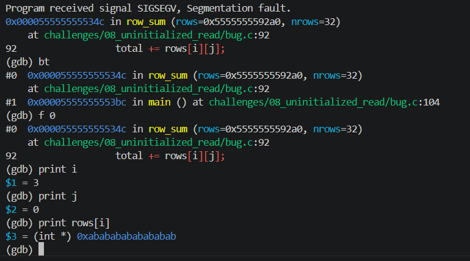
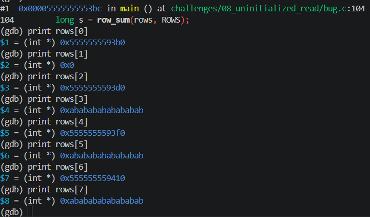

<!-- generated from vault: 08_uninitialized_read 코드 분석.md — 편집은 Obsidian에서 -->
---
분류: 코드 분석
버그유형: 초기화되지 않은 값 읽기 (uninitialized read)
언어: C
출처: debugging_lab_docker/challenges/08_uninitialized_read/bug.c
날짜: 2026-09-22
---

# 08_uninitialized_read 코드 분석

한 줄 시나리오: 32×4 행렬을 포인터 표(`int **rows`)로 만들고, 짝수 행만 채운 뒤 전체 합을 구한다.

> 증상: `row_sum()`에서 `rows[3][0]` 읽다가 SIGSEGV · 원인: `make_matrix()`가 `malloc`한 포인터 표에서 홀수 행을 채우지 않아 쓰레기(`0xAB…`)가 그대로 남음


## 함수

### 핵심 로직
```C
static int **make_matrix(void) {
    int **rows = malloc(ROWS * sizeof(int *));
    if (!rows) { perror("malloc"); exit(1); }

    for (int i = 0; i < ROWS; i += 2) {
        int *r = malloc(COLS * sizeof(int));
        for (int j = 0; j < COLS; j++) r[j] = i * COLS + j;
        rows[i] = r;
    }
    return rows;
}

static long row_sum(int **rows, int nrows) {
    long total = 0;
    for (int i = 0; i < nrows; i++) {
        for (int j = 0; j < COLS; j++) {
            total += rows[i][j];
        }
    }
    return total;
}
```
- `static int **make_matrix(void)` - 2차원 배열 만들기
- `static long row_sum(int **rows, int nrows)` - 배열의 모든 숫자 더하기

### 기타 (재현 장치·유틸)
```C
/* 힙을 '더럽혀' 두어, 이후 같은 크기 할당이 쓰레기 값을 물려받게 만든다.
   (실무에서 흔한 '이전에 쓰고 free 한 청크의 잔여물' 상황을 재현) */
static void dirty_heap(void) {
    void *scratch = malloc(ROWS * sizeof(int *));
    if (scratch) {
        memset(scratch, 0xAB, ROWS * sizeof(int *));
        free(scratch);              /* glibc tcache 로 반환 → 같은 크기 malloc 이 이 블록을
                                       LIFO 로 되돌려받는다(리눅스+glibc 고정이라 결정적). */
    }
}
```

### 메인 함수
```C
int main(void) {
    dirty_heap();

    int **rows = make_matrix();
    printf("summing %dx%d matrix...\n", ROWS, COLS);

    long s = row_sum(rows, ROWS);

    printf("sum = %ld\n", s);

    for (int i = 0; i < ROWS; i += 2) free(rows[i]);
    free(rows);
    return 0;
}
```

실행 흐름
1. 힙을 더럽힘
2. `make_matrix()` **← 원인 지점**: 홀수 행들은 할당은 하지만 초기화는 하지 않음
3. `row_sum()` **← 실제 크래시 지점**: 초기화되지 않은 홀수 행에 접근

## gdb로 잡기

빌드: `make gdb NAME=08_uninitialized_read` (= `gdb ./build/08_uninitialized_read`)

### 1) 죽은 자리 — `run` → `bt`
```
(gdb) run
Program received signal SIGSEGV, Segmentation fault.
0x000055555555534c in row_sum (rows=0x5555555592a0, nrows=32)
    at challenges/08_uninitialized_read/bug.c:92
92                  total += rows[i][j];

(gdb) bt
#0  0x000055555555534c in row_sum (rows=0x5555555592a0, nrows=32)
    at challenges/08_uninitialized_read/bug.c:92
#1  0x00005555555553bc in main () at challenges/08_uninitialized_read/bug.c:104
```
`row_sum()`에서 문제 발생

### 2) 어떤 데이터인지 — `print`, `print *`, `info locals`
```
(gdb) f 0
#0  0x000055555555534c in row_sum (rows=0x5555555592a0, nrows=32)
    at challenges/08_uninitialized_read/bug.c:92
92                  total += rows[i][j];
(gdb) print i
$1 = 3
(gdb) print j
$2 = 0
(gdb) print rows[i]
$3 = (int *) 0xabababababababab
```
3번 행이 초기화되지 않음



### 3) 왜 그 값인지 — `x/`, `print &`, `up`
`int **rows = malloc(ROWS * sizeof(int *));`에서 할당은 했지만
```C
for (int i = 0; i < ROWS; i += 2) {
    int *r = malloc(COLS * sizeof(int));
    for (int j = 0; j < COLS; j++) r[j] = i * COLS + j;
    rows[i] = r;
}
```
여기서 홀수 행은 초기화를 하지 않음



### 4) 누가 언제 그렇게 만들었는지 — `break`, `watch`
```C
int main(void) {
    dirty_heap();
```
애초에 heap영역을 더럽히고 시작함


## 문제
- 초기화 되지 않은 3번 행 `rows[3] = 0xababababab`를 `[j]`로 역참조 -> SIGSEGV

**결론 한 문장:** 홀수 행도 초기화해줘야 한다.


## 수정
- 왜 이 위치에서 고치는가 (책임/소유권): 만드는 `static int **make_matrix(void)`에서 홀수행들도 초기화
- 무엇을 바꾸는가: `int **rows = calloc(ROWS, sizeof(int *));`
	- `malloc`에서 `calloc`으로

정답 코드
```C
#include <stdio.h>
#include <stdlib.h>
#include <string.h>

#define ROWS 32
#define COLS 4

/* 힙을 '더럽혀' 두어, 이후 같은 크기 할당이 쓰레기 값을 물려받게 만든다.
   (실무에서 흔한 '이전에 쓰고 free 한 청크의 잔여물' 상황을 재현) */
static void dirty_heap(void) {
    void *scratch = malloc(ROWS * sizeof(int *));
    if (scratch) {
        memset(scratch, 0xAB, ROWS * sizeof(int *));
        free(scratch);              /* glibc tcache 로 반환 → 같은 크기 malloc 이 이 블록을
                                       LIFO 로 되돌려받는다(리눅스+glibc 고정이라 결정적). */
    }
}

static int **make_matrix(void) {
    int **rows = calloc(ROWS, sizeof(int *));           // int **rows = malloc(ROWS * sizeof(int *));  ← malloc에서 calloc으로
    if (!rows) { perror("malloc"); exit(1); }

    for (int i = 0; i < ROWS; i += 2) {
        int *r = malloc(COLS * sizeof(int));
        for (int j = 0; j < COLS; j++) r[j] = i * COLS + j;
        rows[i] = r;
    }
    return rows;
}

static long row_sum(int **rows, int nrows) {
    long total = 0;
    for (int i = 0; i < nrows; i++) {
        if (!rows[i]) continue;         // 원래 없었음: NULL(안 채운 행)이면 건너뛰기
        for (int j = 0; j < COLS; j++) {
            total += rows[i][j];
        }
    }
    return total;
}

int main(void) {
    dirty_heap();

    int **rows = make_matrix();
    printf("summing %dx%d matrix...\n", ROWS, COLS);

    long s = row_sum(rows, ROWS);

    printf("sum = %ld\n", s);

    for (int i = 0; i < ROWS; i += 2) free(rows[i]);
    free(rows);
    return 0;
}
```

검증: 종료 코드 0 · `sum = 3936` (짝수 행 16개만 합산) · valgrind clean · ASan clean


---
<!-- 📋 사용법
     - "증상"과 "원인"의 위치가 다르면 실행 흐름에 둘 다 표시한다 (이게 핵심)
     - gdb 출력은 실제로 찍은 걸 붙이고, 각 블록 아래에 "이 값이 왜 이상한지" 한 줄
     - 정답 코드에서 바꾼 줄에는 // 원래 없었음 / // ← 이유 를 남긴다
     - 검증은 크래시 안 남 + 기대 출력 + valgrind 세 가지를 다 적는다
     - 관련 노트: GDB Cheat Sheet
-->
