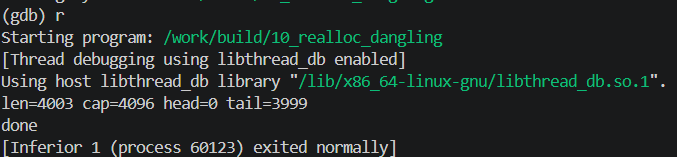

<!-- generated from vault: 10_realloc_dangling 코드 분석.md — 편집은 Obsidian에서 -->
---
분류: 코드 분석
버그유형: dangling pointer (realloc 이동 후 옛 주소 사용) → double free
언어: C
출처: debugging_lab_docker/challenges/10_realloc_dangling/bug.c
날짜: 2026-09-22
---

# 10_realloc_dangling 코드 분석

한 줄 시나리오: 정수 편집 버퍼 EditBuffer. 내용이 커지면 eb_grow() 가 realloc 으로 버퍼를 키운다. "실행 취소(undo)"를 위해 eb_snapshot() 이 현재 상태를 undo[] 에 저장한다.

> 스냅샷을 찍고 값을 많이 추가한 뒤, 정리(eb_free)에서 누수 없이 해제하고 정상 종료.


## 구조체

`EditBuffer`
```C
#define MAX_UNDO 8

typedef struct {
    int   *data;
    size_t len, cap;
    int   *clipboard;
    int   *undo[MAX_UNDO];
    int    undo_n;
} EditBuffer;
```
- `int *data` - 버퍼에 들어갈 data 배열
- `size_t len, cap` - data배열의 길이와 용량
- `int *clipboard` - data바로 뒤에 놓이는 별도의 할당
	- `realloc` 시 뒤에가 비어있으면 제자리에서 늘리고 뒤에가 비어있지 않으면 이동하여 재할당


## 함수

### 종류별 동작
```C
static void eb_init(EditBuffer *e) {
    e->cap = 4;
    e->len = 0;
    e->undo_n = 0;
    e->data = malloc(e->cap * sizeof(int));
    if (!e->data) { perror("malloc"); exit(1); }
    /* data 바로 뒤에 놓이는 별도 할당. data 가 힙 맨 끝(top)이 아니게 되어
       이후 realloc 이 제자리 확장 대신 '이동'을 택하게 만든다(→ 옛 블록 해제). */
    e->clipboard = malloc(e->cap * sizeof(int));
    if (!e->clipboard) { perror("malloc"); exit(1); }
}

static void eb_snapshot(EditBuffer *e) {
    if (e->undo_n < MAX_UNDO) e->undo[e->undo_n++] = e->data;
}

static void eb_push(EditBuffer *e, int v) {
    if (e->len == e->cap) eb_grow(e, e->len + 1);
    e->data[e->len++] = v;
}

static void eb_grow(EditBuffer *e, size_t need) {
    size_t nc = e->cap;
    while (nc < need) nc *= 2;
    int *p = realloc(e->data, nc * sizeof(int));
    if (!p) { perror("realloc"); free(e->data); exit(1); }
    e->data = p;
    e->cap = nc;
}

static void eb_free(EditBuffer *e) {
    free(e->data);
    free(e->clipboard);
    for (int i = 0; i < e->undo_n; i++) {
        free(e->undo[i]);
    }
    e->undo_n = 0;
    e->data = NULL;
}
```
- `static void eb_init(EditBuffer *e)` - 정수 편집 버퍼 생성 함수
- `static void eb_snapshot(EditBuffer *e)` - 이전 값으로 돌아가기 위해서 `e->undo`배열에 값 삽입
- `static void eb_push(EditBuffer *e, int v)`
	- `e`의 용량이 부족하다면 `eb_grow`하여 용량 증가
	- 해당 데이터 `e->data[]`에 삽입
- `static void eb_grow(EditBuffer *e, size_t need)` - 용량 2배 증가 및 메모리 재할당(위치 이동)
- `static void eb_free(EditBuffer *e)` - 해당 버퍼 free

### 메인 함수
```C
int main(void) {
    EditBuffer e;
    eb_init(&e);

    for (int i = 0; i < 3; i++) eb_push(&e, i);

    eb_snapshot(&e);

    for (int i = 0; i < 4000; i++) eb_push(&e, i);

    printf("len=%zu cap=%zu head=%d tail=%d\n",
           e.len, e.cap, e.data[0], e.data[e.len - 1]);

    eb_free(&e);
    printf("done\n");
    return 0;
}
```

실행 흐름
1.  `EditBuffer e`선언 및 초기화
2.  `e`에 데이터 삽입, 현재 `e->data` **포인터**(주소)를 `e->undo[0]`에 저장
3.  `e`에 새로운 데이터 삽입 
4.  데이터가 많아 `eb_grow()`, `realloc()`실행 **← 원인 지점**: `realloc`이 실행되면서 기존에 있던 `e->data`를 해제하여 `e->undo[0]`가 가리키고 있는 곳이 해제됨. 
5. `eb_free(&e)` **← 실제 크래시 지점**: 이미 해제된 `e->undo[0]`을 또 해제하며 double free, SIGABRT

**`e->undo[]`는 포인터로 가리키는 것이 아니라 데이터를 복사해서 기억해야 한다.**


## gdb로 잡기

빌드: `make gdb NAME=` (= `gdb ./build/`)

### 1) 죽은 자리 — `run` → `bt`
```
(gdb) run
free(): double free detected in tcache 2

Program received signal SIGABRT, Aborted.
0x00007ffff7e43c0c in pthread_kill () from /lib/x86_64-linux-gnu/libc.so.6
(gdb) bt
#0  0x00007ffff7e43c0c in pthread_kill () from /lib/x86_64-linux-gnu/libc.so.6
#1  0x00007ffff7dea27e in raise () from /lib/x86_64-linux-gnu/libc.so.6
#2  0x00007ffff7dcd8ff in abort () from /lib/x86_64-linux-gnu/libc.so.6
#3  0x00007ffff7dce7b6 in ?? () from /lib/x86_64-linux-gnu/libc.so.6
#4  0x00007ffff7e4e0d5 in ?? () from /lib/x86_64-linux-gnu/libc.so.6
#5  0x00007ffff7e5063f in ?? () from /lib/x86_64-linux-gnu/libc.so.6
#6  0x00007ffff7e52eae in free () from /lib/x86_64-linux-gnu/libc.so.6
#7  0x0000555555555483 in eb_free (e=0x7fffffffdde0) at challenges/10_realloc_dangling/bug.c:85
```
double free 로 인한 SIGABRT

### 2) 어떤 데이터인지 — `print`, `print *`, `info locals`
```
(gdb) f 7
#7  0x0000555555555483 in eb_free (e=0x7fffffffdde0) at challenges/10_realloc_dangling/bug.c:85
85              free(e->undo[i]);
(gdb) print e
$1 = (EditBuffer *) 0x7fffffffdde0
(gdb) print e->undo[i]
$2 = (int *) 0x5555555592a0
```
`free(e->undo[i]);`에서 오류

### 3) 누가 언제 그렇게 만들었는지 — `break`, `watch`
```
(gdb) break main
(gdb) run

// eb_init(&e); 직후 e->data 주소
(gdb) print e->data
$30 = (int *) 0x5555555592a0

// eb_push, eb_grow(realloc)호출 이후 e->data 주소, e->undo 주소
(gdb) print e->data
$3 = (int *) 0x5555555592e0
(gdb) print e->undo
$4 = {0x5555555592a0, 0x0, 0x0, 0x0, 0x0, 0x0, 0x0, 0x7ffff7fe5af0}
(gdb) print e->undo[0]
$5 = (int *) 0x5555555592a0           // 처음 init직후 e->data의 주소와 같음
```
`eb_grow() (realloc)`이후 `e->undo[0]`를 해제하려고 할 때, SIGABRT오류(double free) 발생

#### 추가 정보
`void *realloc (void *__ptr, size_t __size)`
- 이미 할당된 메모리공간 뒤에 빈 공간이 있을 경우, 기존 메모리 공간 뒤에 함께 사용할 수 있도록 배치
	- 메모리 주소는 같다.
- 이미 할당된 메모리공간 뒤에 빈 공간이 없을 경우, 할당 위치를 옮긴다.
	- 주소가 이동하여 새로운 메모리가 할당되면, 기존에 있던 원래 메모리는 **`realloc()`내부에서 자동으로 반환**된다.
- C 표준(§7.22.3.5)은 "deallocates the old object"라고만 정의한다. 즉 **이동 여부와 무관하게** `realloc` 뒤에 옛 포인터를 쓰는 건 정의되지 않은 동작이고, 항상 반환값으로 갈아타야 한다.


### 정리
| 단계  | 함수            | 무슨 일                                                |
| --- | ------------- | --------------------------------------------------- |
| 원인  | `realloc()`   | `e->data`를 재할당 하며 기존의 `e->undo[0]`을 가리키고 있던 메모리를 해제 |
| 전파  | `eb_free(&e)` | 해제되어버린 `e->undo[0]`을 또 해제해버림                        |
| 증상  |               | SIGABRT, double free                                |


## 문제
- `e->undo[0]`과 `e->data`가 **같은 블록을 공유**하는데 소유자는 `e->data`뿐이다. `realloc`이 그 블록을 해제하는 순간 `e->undo[0]`은 dangling이 된다.
- `e->undo[0]`은 데이터를 가지고 있는 것이 아니라 `e->data`포인터를 가지고 있다.

**결론 한 문장:** `e->undo[]`는 포인터가 아니라 복사된 데이터를 가리키고 있어야 해제되지 않는다.


## 수정
- 왜 이 위치에서 고치는가 (책임/소유권): `eb_snapshot(EditBuffer *e)` - 스냅샷이 해당 순간의 데이터들을 저장해야하는 책임이 있기 때문에 포인터만 저장하는 것이 아닌 데이터 자체를 저장해야한다.
- 무엇을 바꾸는가: 포인터만을 가리키는 것이 아니라 메모리를 할당하여 복사된 데이터를 가리키게 한다.
	- `e->undo[e->undo_n] = malloc(undo_size);` - 메모리 할당
	- `memcpy(e->undo[e->undo_n], e->data, undo_size);` - 해당 메모리에 데이터 복사
	- `size_t undo_size = sizeof(*(e->data)) * e->len;` , `e->undo_n++;` - 계속 사용되는 사이즈 선언 및 다음 요소로 이동


정답 코드
```C
#include <stdio.h>
#include <stdlib.h>
#include <string.h>

#define MAX_UNDO 8
typedef struct {
    int   *data;
    size_t len, cap;
    int   *clipboard;
    int   *undo[MAX_UNDO];
    int    undo_n;
} EditBuffer;

static void eb_init(EditBuffer *e) {
    e->cap = 4;
    e->len = 0;
    e->undo_n = 0;
    e->data = malloc(e->cap * sizeof(int));
    if (!e->data) { perror("malloc"); exit(1); }
    /* data 바로 뒤에 놓이는 별도 할당. data 가 힙 맨 끝(top)이 아니게 되어
       이후 realloc 이 제자리 확장 대신 '이동'을 택하게 만든다(→ 옛 블록 해제). */
    e->clipboard = malloc(e->cap * sizeof(int));
    if (!e->clipboard) { perror("malloc"); exit(1); }
}

static void eb_snapshot(EditBuffer *e) {
    // if (e->undo_n < MAX_UNDO) e->undo[e->undo_n++] = e->data;   // 원래 코드: 포인터만 저장
    if (e->undo_n < MAX_UNDO){
        size_t undo_size = sizeof(*(e->data)) * e->len;             // 원래 없었음
        e->undo[e->undo_n] = malloc(undo_size);                     // 원래 없었음: 복사본 소유
        memcpy(e->undo[e->undo_n], e->data, undo_size);             // 원래 없었음

        e->undo_n++;
    }
}

static void eb_grow(EditBuffer *e, size_t need) {
    size_t nc = e->cap;
    while (nc < need) nc *= 2;
    int *p = realloc(e->data, nc * sizeof(int));
    if (!p) { perror("realloc"); free(e->data); exit(1); }
    e->data = p;
    e->cap = nc;
}

static void eb_push(EditBuffer *e, int v) {
    if (e->len == e->cap) eb_grow(e, e->len + 1);
    e->data[e->len++] = v;
}

static void eb_free(EditBuffer *e) {
    free(e->data);
    free(e->clipboard);
    for (int i = 0; i < e->undo_n; i++) {
        free(e->undo[i]);
    }
    e->undo_n = 0;
    e->data = NULL;
}

int main(void) {
    EditBuffer e;
    eb_init(&e);

    for (int i = 0; i < 3; i++) eb_push(&e, i);

    eb_snapshot(&e);

    for (int i = 0; i < 4000; i++) eb_push(&e, i);

    printf("len=%zu cap=%zu head=%d tail=%d\n",
           e.len, e.cap, e.data[0], e.data[e.len - 1]);

    eb_free(&e);
    printf("done\n");
    return 0;
}
```

검증: 종료 코드 · 기대 출력 일치 여부 · valgrind / ASan 결과



---
<!-- 📋 사용법
     - "증상"과 "원인"의 위치가 다르면 실행 흐름에 둘 다 표시한다 (이게 핵심)
     - gdb 출력은 실제로 찍은 걸 붙이고, 각 블록 아래에 "이 값이 왜 이상한지" 한 줄
     - 정답 코드에서 바꾼 줄에는 // 원래 없었음 / // ← 이유 를 남긴다
     - 검증은 크래시 안 남 + 기대 출력 + valgrind 세 가지를 다 적는다
     - 관련 노트: GDB Cheat Sheet
-->
