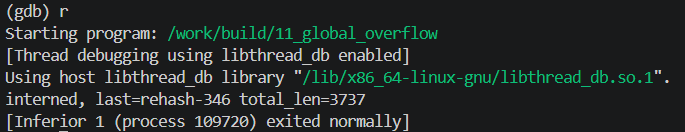

<!-- generated from vault: 11_global_overflow 코드 분석.md — 편집은 Obsidian에서 -->
---
분류: 코드 분석
버그유형: 전역 버퍼 오버플로 (bump 할당 경계 미검사) → 인접 전역(arena_off) 훼손
언어: C
출처: debugging_lab_docker/challenges/11_global_overflow/bug.c
날짜: 2026-09-22
---

# 11_global_overflow

한 줄 시나리오:  고정 크기 전역 버퍼(arena, .bss)를 "bump 포인터" 방식으로 나눠 쓰는 초간단 할당기. 문자열 인터너(intern)가 들어온 문자열을 아레나에 복사해 보관한다.

> 기대 동작: 문자열을 차례로 아레나에 인터닝하고, 마지막 문자열과 전체 길이 합을 출력한 뒤 정상 종료.


## 전역변수

```C
#define ARENA_SIZE 4096
static unsigned char arena[ARENA_SIZE];    /* 전역(.bss) 아레나 */
static size_t arena_off = 0;
```
- `static unsigned char arena[ARENA_SIZE]` - 전역으로 사용할 `arena`소
- `static size_t arena_off = 0` - 다음 저장해야할 위치 오프셋

## 함수

### 핵심 로직
```C
static void *arena_alloc(size_t n) {
    void *p = &arena[arena_off];
    arena_off += n;
    return p;
}


static char *intern(const char *s) {
    size_t n = strlen(s) + 1;
    char *dst = arena_alloc(n);
    memcpy(dst, s, n);                      /* 경계를 넘은 위치면 여기서 크래시 */
    return dst;
}
```
- `static void *arena_alloc(size_t n)` - 전역 변수 `arena`의 저장소 할당
- `static char *intern(const char *s)` - `s`전역 변수 `arena`에 삽입


### 메인 함수
```C
int main(void) {
    const char *words[] = {
        "insert", "delete", "search", "traverse", "balance",
        "rotate", "rehash", "compact", "serialize", "checkpoint",
    };
    int nwords = (int)(sizeof(words) / sizeof(words[0]));

    char *last = NULL;
    long total = 0;
    for (int i = 0; i < 100000; i++) {
        char buf[32];
        snprintf(buf, sizeof buf, "%s-%d", words[i % nwords], i);
        last = intern(buf);
        total += (long)strlen(last);
    }

    printf("interned, last=%s total_len=%ld\n", last, total);
    return 0;
}
```

실행 흐름
1. `words`, `nwords`, `*last`, `total` 초기화
2. 반복문을 돌며 `buf`에 문자열 작성
3. `intern`에서 `arena_alloc(n)`으로 `arena`의 저장 위치를 할당받음 (경계 검사 없이 `arena_off`만 증가)
4. `arena_off`가 `ARENA_SIZE`(4096)에 도달/초과 **← 원인 지점**: `arena_alloc`이 남은 공간을 검사하지 않고 offset만 bump
5. `&arena[4096]`이 배열 바로 뒤에 놓인 `arena_off` 변수를 가리킴 → `memcpy`가 그 자리에 문자열("serialize-348")을 써서 `arena_off` 자신을 덮음 **← 오염/전파 지점**: `arena_off`가 거대한 쓰레기 값(`8820700510818559347`)이 됨
6. 다음 호출에서 `&arena[쓰레기값]`이 와일드 포인터(`0x7a69...`)가 되고 거기에 `memcpy` **← 실제 크래시 지점**: 매핑 안 된 주소 접근 → SIGSEGV

## gdb로 잡기

빌드: `make gdb NAME=` (= `gdb ./build/`)

### 1) 죽은 자리 — `run` → `bt`
```
(gdb) run
Program received signal SIGSEGV, Segmentation fault.
0x00007ffff7f2de08 in ?? () from /lib/x86_64-linux-gnu/libc.so.6
(gdb) bt
#0  0x00007ffff7f2de08 in ?? () from /lib/x86_64-linux-gnu/libc.so.6
#1  0x000055555555525e in intern (s=0x7fffffffde20 "checkpoint-349")
    at challenges/11_global_overflow/bug.c:66
#2  0x0000555555555367 in main () at challenges/11_global_overflow/bug.c:87
```
`intern()`에서 SIGSEGV 발생

### 2) 어떤 데이터인지 — `print`, `print *`, `info locals`
```
(gdb) print dst
$2 = 0x7a69c1b6bec7e5b3 <error: Cannot access memory at address 0x7a69c1b6bec7e5b3>
(gdb) print buf
No symbol "buf" in current context.
(gdb) print s
$3 = 0x7fffffffde20 "checkpoint-349"
(gdb) print n
$4 = 15
// 여기까진 문제 없어 보임

(gdb) print arena_off
$1 = 8820700510818559362
```
`arena_off`가 `arena`의 크기보다 작아야하는데 넘쳐버렸다.

### 3) 왜 그 값인지 — `x/`, `print &`, `up`
```
(gdb) up
#2  0x0000555555555367 in main () at challenges/11_global_overflow/bug.c:87
87              last = intern(buf);
(gdb) print last
$5 = 0x555555559040 <arena_off> "\202erialize-348"
(gdb) print total
$6 = 3761
(gdb) print buf
$7 = "checkpoint-349\000\000\000\000\000\000\000\000\000\000\360Z\376\367\377\177\000"
```
`last`가 `<arena_off>`를 가리키고 그 내용이 "serialize-348"이다. 즉 배열 밖으로 넘어간 쓰기가 바로 뒤의 `arena_off` 변수를 덮은 것.

### 4) 누가 언제 그렇게 만들었는지 — `break`, `watch`
```
(gdb) break arena_alloc
(gdb) run
...

Breakpoint 1, arena_alloc (n=12) at challenges/11_global_overflow/bug.c:54
54          void *p = &arena[arena_off];
1: arena_off = 4084
(gdb)
Continuing.

Breakpoint 1, arena_alloc (n=14) at challenges/11_global_overflow/bug.c:54
54          void *p = &arena[arena_off];
1: arena_off = 4096
(gdb)
Continuing.

Breakpoint 1, arena_alloc (n=15) at challenges/11_global_overflow/bug.c:54
54          void *p = &arena[arena_off];
1: arena_off = 8820700510818559347
```
`arena_off`에 대한 조건 없이 계속 할당하여, 4096이 된 순간 `&arena[4096]`(= `arena_off` 자리)에 `memcpy`가 문자열을 쓰고, 그 뒤부터 `arena_off`가 쓰레기 값이 됐다.

### 정리
| 단계 | 함수 | 무슨 일 |
|---|---|---|
| 원인 | `arena_alloc` | 남은 공간을 검사하지 않고 `arena_off`만 증가(bump) → 경계를 넘어도 포인터를 반환 |
| 전파 | `memcpy` (intern) | `&arena[4096]` = 배열 바로 뒤 `arena_off` 변수. 여기에 문자열("serialize-348")을 써서 커서(`arena_off`)를 쓰레기 값으로 덮음 |
| 증상 | `memcpy` (intern) | 다음 호출에서 쓰레기 `arena_off`로 만든 와일드 포인터(`0x7a69...`)에 쓰기 → SIGSEGV |


## 문제
- `arena_off`가 `sizeof(arena)`를 넘어가 허용되지 않는 저장주소에 접근한다.

**결론 한 문장:** `arena_off`가 `sizeof(arena)`를 넘지 않도록 조건식을 넣어야 한다.


## 수정
- 왜 이 위치에서 고치는가 (책임/소유권): `static void *arena_alloc(size_t n)` - `arena`을 할당해주는 함수로 `arena`를 넘어서 할당하지 않도록 하는 책임이 있기 때문이다.
- 무엇을 바꾸는가: 조건식 추가
	- `if (arena_off >= sizeof(arena)) return NULL;` 추가

### 추가 수정
- 각 함수에 `NULL`반환에 대한 조건 추가
- `main`에서 `NULL`반환에 대한 조건 추가

정답 코드
```C
#include <stdio.h>
#include <stdlib.h>
#include <string.h>

#define ARENA_SIZE 4096
static unsigned char arena[ARENA_SIZE];    /* 전역(.bss) 아레나 */
static size_t arena_off = 0;

static void *arena_alloc(size_t n) {
    void *p = &arena[arena_off];
    arena_off += n;
    // why? 맨 위에서 하면 n을 더하기 전이라 이번 쓰기가 넘치는지 못 잡음
    // ARENA_SIZE 말고 sizeof(arena)? arena 크기를 바꿔도 자동으로 따라와 더 안전
    if (arena_off >= sizeof(arena)) return NULL;        // 원래 없었음
    return p;
}


static char *intern(const char *s) {
    size_t n = strlen(s) + 1;
    char *dst = arena_alloc(n);
    if (!dst) return NULL;                              // 원래 없었음
    memcpy(dst, s, n);                      /* 경계를 넘은 위치면 여기서 크래시 */
    return dst;
}

int main(void) {
    const char *words[] = {
        "insert", "delete", "search", "traverse", "balance",
        "rotate", "rehash", "compact", "serialize", "checkpoint",
    };
    int nwords = (int)(sizeof(words) / sizeof(words[0]));

    char *last = NULL;
    long total = 0;
    for (int i = 0; i < 100000; i++) {
        char buf[32];
        snprintf(buf, sizeof buf, "%s-%d", words[i % nwords], i);
        char *p;
        if (!(p = intern(buf))) break;                 // 원래 없었음: NULL이면 멈춤
        else last = p;
        // last = intern(buf);
        total += (long)strlen(last);
    }

    printf("interned, last=%s total_len=%ld\n", last, total);
    return 0;
}
```

검증: 종료 코드 0 · `interned, last=rehash-346 total_len=3737` · valgrind clean · ASan clean (ARENA_SIZE 4096, 4100 모두)



---
<!-- 📋 사용법
     - 맨 위 "기대 동작"은 코드를 읽기 전에 문제 설명에서 옮겨 적는다. 수정 후 검증의 기준이 된다
     - 증상·원인은 풀고 난 뒤 "정리" 표와 "문제"에 쓴다 (풀기 전에 쓰면 힌트가 됨)
     - "증상"과 "원인"의 위치가 다르면 실행 흐름에 둘 다 표시한다 (이게 핵심)
     - gdb 출력은 실제로 찍은 걸 붙이고, 각 블록 아래에 "이 값이 왜 이상한지" 한 줄
     - 정답 코드에서 바꾼 줄에는 // 원래 없었음 / // ← 이유 를 남긴다
     - 검증은 크래시 안 남 + 기대 출력 + valgrind 세 가지를 다 적는다
     - 관련 노트: GDB Cheat Sheet
-->
