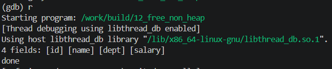

<!-- generated from vault: 12_free_non_heap 코드 분석.md — 편집은 Obsidian에서 -->
---
분류: 코드 분석
버그유형: 비힙 포인터 free (strtok가 준 내부 포인터를 해제) → invalid pointer
언어: C
출처: debugging_lab_docker/challenges/12_free_non_heap/bug.c
날짜: 2026-09-23
---

# 12_free_non_heap 코드 분석

한 줄 시나리오: 한 줄짜리 CSV 를 파싱한다. 원본 줄을 힙에 복사(strdup)한 뒤 strtok 으로 쉼표를 '\0' 로 바꿔가며 각 필드의 시작 주소를 `Row.fields[]` 에 담는다.

> 기대 동작: 필드들을 출력하고, 할당한 버퍼를 누수 없이 해제.


## 구조체

`Row`
```C
#define MAX_FIELDS 8

typedef struct {
    char *base;                  /* 원본(=malloc 이 돌려준) 버퍼 */
    char *fields[MAX_FIELDS];    /* 각 필드 시작(대개 base 내부를 가리킴) */
    int   n;
} Row;
```
- `char *base` - `malloc()`으로 할당해준 원본 버퍼
	- `strdup()`으로 할당받음
- `char *fields[MAX_FIELDS]` - `base`를 쉼표로 나눈 문자열들을 모아둘 배열
- `int n` - `fields`의 개수

#### 추가정보
- `char *strdup (const char *__s)` - `s`를 복제하여, 동일한 내용의 `malloc`으로 할당된 문자열을 반환
	- Duplicate S, returning an identical malloc'd string.


## 함수

### 핵심 로직
```C
static void parse_row(Row *r, const char *csv) {
    r->base = strdup(csv);
    if (!r->base) { perror("strdup"); exit(1); }
    r->n = 0;

    for (char *tok = strtok(r->base, ","); tok && r->n < MAX_FIELDS;
         tok = strtok(NULL, ",")) {
        r->fields[r->n++] = tok;  /* fields[0]=base, 나머지는 내부 포인터 */
    }
}

static void row_print(const Row *r) {
    printf("%d fields:", r->n);
    for (int i = 0; i < r->n; i++) printf(" [%s]", r->fields[i]);
    printf("\n");
}

static void row_free(Row *r) {
    for (int i = 0; i < r->n; i++) {
        free(r->fields[i]);
    }
    r->n = 0;
}
```
- `static void parse_row(Row *r, const char *csv)` - `r->base`에 메모리와 문자열을 할당받고 `r->fields`를 쉼표 기준으로 나누어 각 문자열을 저장
- `static void row_print(const Row *r)` - 각 `fields`들 출력
- `static void row_free(Row *r)` - 각 `fields`들 메모리 해제

### 메인 함수
```C
int main(void) {
    Row r;
    parse_row(&r, "id,name,dept,salary");
    row_print(&r);

    row_free(&r);
    printf("done\n");
    return 0;
}
```

실행 흐름
1. `Row r` 선언 및 `parse_row`로 초기화
2. `r` 출력
3. `row_free`로 메모리 해제
4. `free(r->fields[i])`로 필드 메모리 해제 **← 실제 크래시 지점**: 할당되지 않은(내부 포인터) 메모리 해제


## gdb로 잡기

빌드: `make gdb NAME=` (= `gdb ./build/`)

### 1) 죽은 자리 — `run` → `bt`
```
(gdb) run

free(): invalid pointer

Program received signal SIGABRT, Aborted.
0x00007ffff7e43c0c in pthread_kill () from /lib/x86_64-linux-gnu/libc.so.6
(gdb) bt
#0  0x00007ffff7e43c0c in pthread_kill () from /lib/x86_64-linux-gnu/libc.so.6
#1  0x00007ffff7dea27e in raise () from /lib/x86_64-linux-gnu/libc.so.6
#2  0x00007ffff7dcd8ff in abort () from /lib/x86_64-linux-gnu/libc.so.6
#3  0x00007ffff7dce7b6 in ?? () from /lib/x86_64-linux-gnu/libc.so.6
#4  0x00007ffff7e4e0d5 in ?? () from /lib/x86_64-linux-gnu/libc.so.6
#5  0x00007ffff7e5046c in ?? () from /lib/x86_64-linux-gnu/libc.so.6
#6  0x00007ffff7e52eae in free () from /lib/x86_64-linux-gnu/libc.so.6
#7  0x00005555555553b9 in row_free (r=0x7fffffffde00)
    at challenges/12_free_non_heap/bug.c:82
#8  0x0000555555555420 in main () at challenges/12_free_non_heap/bug.c:92
```
유효하지 않은 포인터로 `free()`실행

### 2) 어떤 데이터인지 — `print`, `print *`, `info locals`
```
(gdb) f 7
#7  0x00005555555553b9 in row_free (r=0x7fffffffde00)
    at challenges/12_free_non_heap/bug.c:82
82              free(r->fields[i]);

(gdb) print r->fields
$2 = {0x5555555592a0 "YUUU\005", 0x5555555592a3 "U\005",
  0x5555555592a8 "\300\024\215\274\205\226\267?ary",
  0x5555555592ad "\226\267?ary", 0x0, 0x0, 0x0, 0x0}
(gdb) print r->base
$3 = 0x5555555592a0 "YUUU\005"
(gdb) print i
$4 = 1
```
`r->fields[0]`과 `r->base`의 주소값은 같다. 그래서 반복문에서 `r->fields[0] (== r->base)`는 잘 `free()`가 되었지만 `r->fields[1]`를 `free()`할 때 오류가 발생한다.

### 정리
| 단계  | 함수                  | 무슨 일                                       |
| --- | ------------------- | ------------------------------------------ |
| 원인  | `row_free(&r)`      | `row`에 있는 모든 `r->fields[]`를 모두 `free()`    |
| 전파  | `free(r->fields[])` | 유효하지 않은 포인터 `r->fields[1]`(base 내부 주소)을 해제 |
| 증상  | `free` (libc)       | `free(): invalid pointer` -> SIGABRT       |


## 문제
- 메모리를 할당 받지 않은 포인터 `r->fields[1]`를 `free()`하며 `free(): invalid pointer` SIGABRT발생

**결론 한 문장:** `free()`할당 해제는 할당 받은 포인터(`r->base`)로만 한다.


## 수정
- 왜 이 위치에서 고치는가 (책임/소유권): `static void row_free(Row *r)` - `Row r`을 메모리 해제할 책임이 있다.
- 무엇을 바꾸는가: 메모리를 할당받은 `r->base`로 메모리 해제
	- `free(r->base)` 추가
	- `free(r->fields[i]);` 삭제

### 추가 수정
- `r->fields[i] = NULL` 추가

정답 코드
```C
#define _POSIX_C_SOURCE 200809L
#include <stdio.h>
#include <stdlib.h>
#include <string.h>

#define MAX_FIELDS 8
typedef struct {
    char *base;                  /* 원본(=malloc 이 돌려준) 버퍼 */
    char *fields[MAX_FIELDS];    /* 각 필드 시작(대개 base 내부를 가리킴) */
    int   n;
} Row;

static void parse_row(Row *r, const char *csv) {
    r->base = strdup(csv);
    if (!r->base) { perror("strdup"); exit(1); }
    r->n = 0;

    for (char *tok = strtok(r->base, ","); tok && r->n < MAX_FIELDS;
         tok = strtok(NULL, ",")) {
        r->fields[r->n++] = tok;  /* fields[0]=base, 나머지는 내부 포인터 */
    }
}

static void row_print(const Row *r) {
    printf("%d fields:", r->n);
    for (int i = 0; i < r->n; i++) printf(" [%s]", r->fields[i]);
    printf("\n");
}

static void row_free(Row *r) {
    free(r->base);                          // 원래 없었음: 할당받은 버퍼 하나만 해제
    for (int i = 0; i < r->n; i++) {
        // free(r->fields[i]);              // 내부 포인터라 free 대상 아님
        r->fields[i] = NULL;                // 원래 없었음
    }
    r->n = 0;
}

int main(void) {
    Row r;
    parse_row(&r, "id,name,dept,salary");
    row_print(&r);

    row_free(&r);
    printf("done\n");
    return 0;
}
```

검증: 종료 코드 0 · `4 fields: [id] [name] [dept] [salary]` / `done` · valgrind clean · ASan clean



---
<!-- 📋 사용법
     - 맨 위 "기대 동작"은 코드를 읽기 전에 문제 설명에서 옮겨 적는다. 수정 후 검증의 기준이 된다
     - 증상·원인은 풀고 난 뒤 "정리" 표와 "문제"에 쓴다 (풀기 전에 쓰면 힌트가 됨)
     - "증상"과 "원인"의 위치가 다르면 실행 흐름에 둘 다 표시한다 (이게 핵심)
     - gdb 출력은 실제로 찍은 걸 붙이고, 각 블록 아래에 "이 값이 왜 이상한지" 한 줄
     - 정답 코드에서 바꾼 줄에는 // 원래 없었음 / // ← 이유 를 남긴다
     - 검증은 크래시 안 남 + 기대 출력 + valgrind 세 가지를 다 적는다
     - 관련 노트: GDB Cheat Sheet
-->
