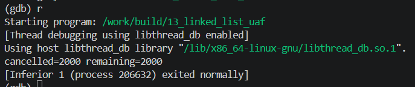

<!-- generated from vault: 13_linked_list_uaf 코드 분석.md — 편집은 Obsidian에서 -->
---
분류: 코드 분석
버그유형: Use-After-Free (해제한 노드의 next를 읽음)
언어: C
출처: debugging_lab_docker/challenges/13_linked_list_uaf/bug.c
날짜: 2026-09-23
---

# 13_linked_list_uaf 코드 분석

한 줄 시나리오: 우선순위가 있는 잡(Job)들을 단일 연결 리스트 큐로 관리한다. 스케줄러가 "임계값 미만 우선순위"의 잡을 큐에서 제거(취소)하며, 제거된 잡의 id 를 감사로그(동적 배열)에 기록한다.

> 기대 동작: 저우선순위 잡을 모두 제거하고, 취소된 개수와 남은 개수를 출력한 뒤 정상 종료.


## 구조체

#### `Job`
```C
typedef struct Job {
    int id;
    int priority;
    struct Job *next;
} Job;
```
- `int id` - 해당 `Job`의 `id`
- `int priority` - 해당 `Job`의 우선순위
- `struct Job *next` - 다음 작업의 주소

#### `Audit`
```C
typedef struct {
    int   *ids;
    size_t len, cap;
} Audit;
```
- `int *ids` - 작업들의 `id`를 모아두는 가변 배열
- `size_t len, cap` - 길이와 용량

우선순위에서 특정 우선순위보다 낮은 우선순위 작업만 남겨놓는 구조체


## 함수

### `Audit`
```C
static void audit_add(Audit *a, int id) {
    if (a->len == a->cap) {
        a->cap = a->cap ? a->cap * 2 : 16;
        int *p = realloc(a->ids, a->cap * sizeof(int));
        if (!p) { perror("realloc"); exit(1); }
        a->ids = p;
    }
    a->ids[a->len++] = id;
}
```
- `static void audit_add(Audit *a, int id)` - 취소된 작업들을 `a->ids[]`에 넣음

### `Job`
```C
static Job *push_job(Job *head, int id, int priority) {
    Job *n = malloc(sizeof *n);
    if (!n) { perror("malloc"); exit(1); }
    n->id = id;
    n->priority = priority;
    n->next = head;
    return n;
}

/* 취소된 잡을 반납한다(해제 책임은 이 함수가 진다). */
static void job_release(Job *j) {
    free(j);
}
```
- `static Job *push_job(Job *head, int id, int priority)` - 작업들을 연결리스트 형태로 넣음(LIFO구조)
- `static void job_release(Job *j)` - 작업들 릴리즈(메모리 해제)

### 핵심 로직
```C
static Job *filter_jobs(Job *head, int threshold, Audit *audit) {
    Job *keep = NULL, *keep_tail = NULL;
    Job *cur = head;

    while (cur != NULL) {
        if (cur->priority < threshold) {
            audit_add(audit, cur->id);
            job_release(cur);
            cur = cur->next;
        } else {
            Job *nx = cur->next;
            cur->next = NULL;
            if (keep_tail) keep_tail->next = cur; else keep = cur;
            keep_tail = cur;
            cur = nx;
        }
    }
    return keep;
}
```
- `static Job *filter_jobs(Job *head, int threshold, Audit *audit)` - `threshold`보다 낮은 우선순위를 가지는 작업들을 취소
	- 취소되는 작업들을 `audit`에 넣고 해당 작업 릴리즈
	- 취소되지 않은 작업들은 `keep`으로 따로 모아둠 (`remain`)

### 메인 함수
```C
int main(void) {
    Job *head = NULL;
    for (int i = 1; i <= 4000; i++)
        head = push_job(head, i, (i * 7) % 10);

    Audit audit = {0};
    head = filter_jobs(head, 5, &audit);

    int remaining = 0;
    for (Job *c = head; c; c = c->next) remaining++;
    printf("cancelled=%zu remaining=%d\n", audit.len, remaining);

    free(audit.ids);
    for (Job *c = head; c; ) { Job *nx = c->next; free(c); c = nx; }
    return 0;
}
```

실행 흐름
1. `Job *head` 선언 및 작업들 푸시
2. 감사 구조체에 `filter_jobs(head, 5, &audit)`으로 필터링
3. `job_release(cur)`로 `cur` 해제 **← 원인 지점**: `cur`을 해제해서 `cur->next`는 쓰레기값이 된다
4. `cur = cur->next` **← 오염/전파 지점**: `cur`을 쓰레기 값으로 채움
5. `if (cur->priority < threshold)` **← 실제 크래시 지점**: 할당되지 않은 쓰레기 값에 접근


## gdb로 잡기

빌드: `make gdb NAME=` (= `gdb ./build/`)

### 1) 죽은 자리 — `run` → `bt`
```
(gdb) run
Program received signal SIGSEGV, Segmentation fault.
0x0000555555555392 in filter_jobs (head=0x555555578680, threshold=5,
    audit=0x7fffffffde30) at challenges/13_linked_list_uaf/bug.c:81
81              if (cur->priority < threshold) {
(gdb) bt
#0  0x0000555555555392 in filter_jobs (head=0x555555578680, threshold=5,
    audit=0x7fffffffde30) at challenges/13_linked_list_uaf/bug.c:81
#1  0x00005555555554c1 in main () at challenges/13_linked_list_uaf/bug.c:102
```
`filter_jobs`에서 SIGSEGV 오류 발생

### 2) 어떤 데이터인지 — `print`, `print *`, `info locals`
```
(gdb) f 0
#0  0x0000555555555392 in filter_jobs (head=0x555555578680, threshold=5,
    audit=0x7fffffffde30) at challenges/13_linked_list_uaf/bug.c:81
81              if (cur->priority < threshold) {
(gdb) print cur
$1 = (Job *) 0x49f03cc347bc6749
(gdb) print cur->priority
Cannot access memory at address 0x49f03cc347bc674d
```
`cur`에 쓰레기 주소값이 들어가 있고, `cur->priority`에 접근할 수 없다.

### 3) 누가 언제 그렇게 만들었는지 — `break`, `watch`
```
(gdb) break filter_jobs
(gdb) run

(gdb) display cur
1: cur = (Job *) 0x555555578680
(gdb) display cur->next
2: cur->next = (struct Job *) 0x555555578660
(gdb) n
83                  job_release(cur);
1: cur = (Job *) 0x555555578680
2: cur->next = (struct Job *) 0x555555578660
(gdb) n
84                  cur = cur->next;
1: cur = (Job *) 0x555555578680
2: cur->next = (struct Job *) 0x3b98b402aa6c74db
(gdb) n
80          while (cur != NULL) {
1: cur = (Job *) 0x3b98b402aa6c74db
2: cur->next = <error: Cannot access memory at address 0x3b98b402aa6c74e3>
(gdb) n
81              if (cur->priority < threshold) {
1: cur = (Job *) 0x3b98b402aa6c74db
2: cur->next = <error: Cannot access memory at address 0x3b98b402aa6c74e3>
```
`job_release(cur)`시 `cur`이 메모리 해제되며 `cur->next`가 쓰레기 주소값이 된다. 해당 쓰레기 주소값을 `cur`에 채워 허용되지 않는 메모리 주소값에 접근해서 SIGSEGV

### 정리
| 단계 | 함수 | 무슨 일 |
|---|---|---|
| 원인 | `filter_jobs` | `job_release(cur)`로 노드를 해제한 뒤 `cur->next`를 읽음 (해제 후 사용) |
| 전파 | `cur = cur->next` | 해제된 메모리의 `next` 필드(쓰레기)를 읽어 `cur`에 넣음 |
| 증상 | `cur->priority` 읽기 | 쓰레기 주소를 역참조 → SIGSEGV |


## 문제
- `cur`을 메모리 해제하면서 `cur->next`의 주소를 잃어버린다.

**결론 한 문장:** `cur`해제 전에 `cur->next`를 기억해둔다.


## 수정
- 왜 이 위치에서 고치는가 (책임/소유권): `static Job *filter_jobs(Job *head, int threshold, Audit *audit)`
- 무엇을 바꾸는가: `cur->next`를 기억할 `Job *tmp`추가 및 `cur = tmp`로 수정

정답 코드
```C
#include <stdio.h>
#include <stdlib.h>

typedef struct Job {
    int id;
    int priority;
    struct Job *next;
} Job;

typedef struct {
    int   *ids;
    size_t len, cap;
} Audit;

static void audit_add(Audit *a, int id) {
    if (a->len == a->cap) {
        a->cap = a->cap ? a->cap * 2 : 16;
        int *p = realloc(a->ids, a->cap * sizeof(int));
        if (!p) { perror("realloc"); exit(1); }
        a->ids = p;
    }
    a->ids[a->len++] = id;
}

static Job *push_job(Job *head, int id, int priority) {
    Job *n = malloc(sizeof *n);
    if (!n) { perror("malloc"); exit(1); }
    n->id = id;
    n->priority = priority;
    n->next = head;
    return n;
}

/* 취소된 잡을 반납한다(해제 책임은 이 함수가 진다). */
static void job_release(Job *j) {
    free(j);
}

static Job *filter_jobs(Job *head, int threshold, Audit *audit) {
    Job *keep = NULL, *keep_tail = NULL;
    Job *cur = head;

    while (cur != NULL) {
        if (cur->priority < threshold) {
            audit_add(audit, cur->id);
            Job *tmp = cur->next;           // 원래 없었음: 해제 전에 next 저장
            job_release(cur);
            // cur = cur->next;             // 해제된 노드를 읽어서 UAF
            cur = tmp;                       // 원래 없었음
        } else {
            Job *nx = cur->next;
            cur->next = NULL;
            if (keep_tail) keep_tail->next = cur; else keep = cur;
            keep_tail = cur;
            cur = nx;
        }
    }
    return keep;
}

int main(void) {
    Job *head = NULL;
    for (int i = 1; i <= 4000; i++)
        head = push_job(head, i, (i * 7) % 10);

    Audit audit = {0};
    head = filter_jobs(head, 5, &audit);

    int remaining = 0;
    for (Job *c = head; c; c = c->next) remaining++;
    printf("cancelled=%zu remaining=%d\n", audit.len, remaining);

    free(audit.ids);
    for (Job *c = head; c; ) { Job *nx = c->next; free(c); c = nx; }
    return 0;
}
```

검증: 종료 코드 0 · `cancelled=2000 remaining=2000` · valgrind clean · ASan clean



---
<!-- 📋 사용법
     - 맨 위 "기대 동작"은 코드를 읽기 전에 문제 설명에서 옮겨 적는다. 수정 후 검증의 기준이 된다
     - 증상·원인은 풀고 난 뒤 "정리" 표와 "문제"에 쓴다 (풀기 전에 쓰면 힌트가 됨)
     - "증상"과 "원인"의 위치가 다르면 실행 흐름에 둘 다 표시한다 (이게 핵심)
     - gdb 출력은 실제로 찍은 걸 붙이고, 각 블록 아래에 "이 값이 왜 이상한지" 한 줄
     - 정답 코드에서 바꾼 줄에는 // 원래 없었음 / // ← 이유 를 남긴다
     - 검증은 크래시 안 남 + 기대 출력 + valgrind 세 가지를 다 적는다
     - 관련 노트: GDB Cheat Sheet
-->
