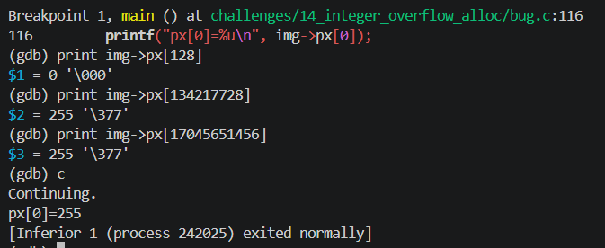

<!-- generated from vault: 14_integer_overflow_alloc 코드 분석.md — 편집은 Obsidian에서 -->
---
분류: 코드 분석
버그유형: 정수 오버플로(int 곱셈 wrap) → 과소할당 → 힙 오버플로
언어: C
출처: debugging_lab_docker/challenges/14_integer_overflow_alloc/bug.c
날짜: 2026-09-23
---

# 14_integer_overflow_alloc 코드 분석

한 줄 시나리오: RGBA 이미지 버퍼를 만든다. 픽셀 바이트 수 = width * height * channels 로 계산해 할당하고, 전 픽셀을 초기값으로 채운다.

> 기대 동작: 이미지 버퍼를 할당·초기화하고 몇몇 픽셀을 읽어 확인한 뒤 정상 종료.


## 구조체

### `Image`
```C
typedef struct {
    int width;
    int height;
    int channels;
    int nbytes;
    unsigned char *px;
} Image;
```
- `int width, height` - 길이, 높이
- `int channels` - 채널의 개수 (ex: RGBA - channels = 4)
- `int nbytes` - 바이트 수
- `unsigned char *px` - 메모리를 할당하여 `px`마다 값을 작성


## 함수

### 핵심 로직
```C
static Image *image_new(int width, int height, int channels) {
    Image *img = malloc(sizeof *img);
    if (!img) { perror("malloc"); exit(1); }
    img->width = width;
    img->height = height;
    img->channels = channels;

    img->nbytes = width * height * channels;
    img->px = malloc((size_t)img->nbytes);
    if (!img->px) { perror("malloc px"); exit(1); }
    return img;
}

static void image_fill(Image *img, unsigned char value) {
    size_t total = (size_t)img->width * (size_t)img->height * (size_t)img->channels;
    for (size_t i = 0; i < total; i++) {
        img->px[i] = value;
    }
}
```
- `static Image *image_new(int width, int height, int channels)` - 새로운 이미지 생성
- `static void image_fill(Image *img, unsigned char value)` - 이미지에 값 저장

### 메인 함수
```C
int main(void) {
    Image *img = image_new(65536, 65536, 4);
    printf("allocated nbytes(int)=%d for %dx%d x%d\n",
           img->nbytes, img->width, img->height, img->channels);

    image_fill(img, 0xFF);

    printf("px[0]=%u\n", img->px[0]);
    free(img->px);
    free(img);
    return 0;
}
```

실행 흐름
1. 이미지 생성
2. `int` 값인 `img->nbytes`를 초기화 **← 원인 지점**: `width*height*channels`를 int 산술로 계산 → 65536*65536*4가 32비트를 넘어 wrap → `nbytes`가 0
3. `malloc(img->nbytes)` **← 오염/전파 지점**: 오버플로된 `nbytes`(0)로 거의 빈 버퍼가 잡힘 (할당 < 실제 필요량)
4. `image_fill()`에서 `total`(size_t, 진짜 16GB)만큼 순회 **← 실제 크래시 지점**: 과소할당된 `px`를 넘어 써서 힙을 벗어남 → SIGSEGV


## gdb로 잡기

빌드: `make gdb NAME=` (= `gdb ./build/`)

### 1) 죽은 자리 — `run` → `bt`
```
(gdb) run
Program received signal SIGSEGV, Segmentation fault.
0x00005555555552da in image_fill (img=0x5555555592a0, value=255 '\377')
    at challenges/14_integer_overflow_alloc/bug.c:73
73              img->px[i] = value;
(gdb) bt
#0  0x00005555555552da in image_fill (img=0x5555555592a0, value=255 '\377')
    at challenges/14_integer_overflow_alloc/bug.c:73
#1  0x0000555555555358 in main () at challenges/14_integer_overflow_alloc/bug.c:93
```
`image_fill`에서 SIGSEGV

### 2) 어떤 데이터인지 — `print`, `print *`, `info locals`
```
(gdb) print i
$1 = 134464

(gdb) print img->px[134463]
$2 = 255 '\377'
```
`img->px[]`은 16GB 할당되어야하는데 134464에서 SIGSEGV오류가 발생함 (그만큼만 할당됐다는 뜻)

### 정리
| 단계 | 함수 | 무슨 일 |
|---|---|---|
| 원인 | `image_new` | 크기를 int 산술로 계산 → 65536*65536*4가 32비트에서 wrap → `nbytes`=0 (과소할당) |
| 전파 | `malloc(nbytes)` | 0에 가까운 버퍼가 잡힘 (할당 < 실제 필요량) |
| 증상 | `image_fill` (`px[i]=value`) | size_t로 16GB만큼 순회하며 작은 버퍼를 넘어 씀 → SIGSEGV |


## 문제
- `img->nbytes`의 자료형이 `int`여서 16GB의 용량이 들어가지 않음 (곱셈도 int로 이뤄져 wrap)

**결론 한 문장:** 크기 계산을 size_t 로 승격하고, 곱셈 오버플로를 검사한다.


## 수정
- 왜 이 위치에서 고치는가 (책임/소유권): `image_new` - 필요한 바이트 수를 계산해 할당하는 곳이라, 잘리지 않는 타입과 오버플로 검사도 여기 책임.
- 무엇을 바꾸는가:
	- `int nbytes` → `size_t nbytes` (대입에서 잘림 제거)
	- `w, h, c`를 size_t로 승격해 곱셈
	- `SIZE_MAX` 나눗셈으로 곱셈 오버플로 검사 → 넘으면 NULL 반환

### 확인용 메모 (실제 정답 아님)
- 올바른 `image_fill`은 주석의 `for (i++) px[i]=value` (또는 `memset(px, value, total)`).
- 이 입력(16GB)에서 그걸 쓰면 **SIGKILL(OOM)** 이 나는데, 이건 버그가 아니라 16GB를 정직하게 요구한 결과. 원래 버그의 **SIGSEGV(과소할당 힙 초과)** 와는 다른 종료.
- 그래서 "int 오버플로가 사라졌는지"만 확인하려고 `i += total/128` stride 루프를 임시로 씀. (작은 이미지에서는 `total/128==0`이라 무한 루프가 되니 확인은 큰 입력 기준)

정답 코드
```C
#include <stdio.h>
#include <stdlib.h>
#include <stdint.h> // SIZE_MAX 로 곱셈 오버플로를 검사하기 위한 헤더

typedef struct {
    int width;
    int height;
    int channels;
    size_t nbytes;                      // 원래 int nbytes; ← 잘림 제거
    unsigned char *px;
} Image;

static Image *image_new(int width, int height, int channels) {
    Image *img = malloc(sizeof *img);
    if (!img) { perror("malloc"); exit(1); }
    img->width = width;
    img->height = height;
    img->channels = channels;

    // img->nbytes = width * height * channels;   // 원래: int 곱셈 → wrap
    size_t w = img->width;                        // 원래 없었음: size_t로 승격
    size_t h = img->height;
    size_t c = img->channels;

    if (w > 0 && h > SIZE_MAX / w) return NULL;    // 원래 없었음: w*h 오버플로 검사
    size_t wh = w * h;
    if (c > 0 && wh > SIZE_MAX / c) return NULL;   // 원래 없었음: *c 오버플로 검사
    img->nbytes = wh * c;

    img->px = malloc(img->nbytes);
    if (!img->px) { perror("malloc px"); exit(1); }
    return img;
}

static void image_fill(Image *img, unsigned char value) {
    size_t total = img->nbytes;

    // 올바른 fill (실제 정답):
    // for (size_t i = 0; i < total; i++) img->px[i] = value;
    // → 이 입력(16GB)에서는 OOM(SIGKILL). 버그 아님, 자원 한계.

    // int 오버플로가 고쳐졌는지만 확인하려는 임시 stride (16GB를 다 안 돎)
    for (size_t i = 0; i < total; i += total/128) {
        img->px[i] = value;
    }
}

int main(void) {
    Image *img = image_new(65536, 65536, 4);
    if (!img) {                                    // 원래 없었음: NULL(오버플로) 처리
        printf("size overflow");
        return -1;
    }
    printf("allocated nbytes=%zu for %dx%d x%d\n",  // %d → %zu (size_t)
           img->nbytes, img->width, img->height, img->channels);

    image_fill(img, 0xFF);

    printf("px[0]=%u\n", img->px[0]);
    free(img->px);
    free(img);
    return 0;
}
```

검증: `image_new`가 `nbytes=17179869184`(=65536²×4)로 정확히 계산 (원래 버그는 0) · 작은 이미지(4×4×4)로 fill 완전성 확인 · 큰 입력은 malloc 실패(exit 1) 또는 OOM(SIGKILL)로 정직하게 종료



---
<!-- 📋 사용법
     - 맨 위 "기대 동작"은 코드를 읽기 전에 문제 설명에서 옮겨 적는다. 수정 후 검증의 기준이 된다
     - 증상·원인은 풀고 난 뒤 "정리" 표와 "문제"에 쓴다 (풀기 전에 쓰면 힌트가 됨)
     - "증상"과 "원인"의 위치가 다르면 실행 흐름에 둘 다 표시한다 (이게 핵심)
     - gdb 출력은 실제로 찍은 걸 붙이고, 각 블록 아래에 "이 값이 왜 이상한지" 한 줄
     - 정답 코드에서 바꾼 줄에는 // 원래 없었음 / // ← 이유 를 남긴다
     - 검증은 크래시 안 남 + 기대 출력 + valgrind 세 가지를 다 적는다
     - 관련 노트: GDB Cheat Sheet
-->
