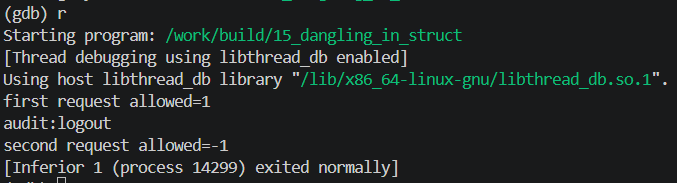

<!-- generated from vault: 15_dangling_in_struct 코드 분석.md — 편집은 Obsidian에서 -->
---
분류: 코드 분석
버그유형: 구조체 멤버 dangling pointer (해제 후 s->user 사용) — UAF
언어: C
출처: debugging_lab_docker/challenges/15_dangling_in_struct/bug.c
날짜: 2026-09-23
---

# 15_dangling_in_struct 코드 분석

한 줄 시나리오: 로그인하면 User 객체를 힙에 만들고, Session 이 그 User 를 가리킨다. User 는 권한 검사 콜백(permission)을 첫 멤버로 가진다. 요청을 처리할 때 세션의 user 를 통해 권한 콜백을 호출한다.

> 기대 동작: 로그인 → 요청 처리(권한 확인) → 로그아웃 순으로 정상 종료.


## 구조체

### `User`
```C
typedef struct {
    PermFn permission;
    int    uid;
    char   name[24];
} User;
```
- `PermFn permission` - 임의의 동작에 대한 허가를 판단하는 함수 포인터
	- `static int allow_all(const char *action)`를 통해 모든 동작에 대해 허가
- `int uid` - 유저의 `id`
- `char name[24]` - 유저 이름

### `Session`
```C
typedef struct {
    User *user;
    int   session_id;
} Session;
```
- `User *user` - 해당 세션에 있는 유저를 가리키는 포인터
- `int session_id` - 세션의 `id`


## 함수

### 유저 동작
```C
static int allow_all(const char *action) { (void)action; return 1; }

static User *login(int uid, const char *name) {
    User *u = malloc(sizeof *u);
    if (!u) { perror("malloc"); exit(1); }
    u->permission = allow_all;
    u->uid = uid;
    strncpy(u->name, name, sizeof(u->name) - 1);
    u->name[sizeof(u->name) - 1] = '\0';
    return u;
}

static void logout(Session *s) {
    free(s->user);
}

static int handle_request(Session *s, const char *action) {
    return s->user->permission(action);
}
```
- `static int allow_all(const char *action)` - 모든 동작 허가에 대한 함수
- `static User *login(int uid, const char *name)` - 유저 로그인 (모든 동작 허가)
- `static void logout(Session *s)` - 해당 세션에 있는 유저 메모리 해제
- `static int handle_request(Session *s, const char *action)` - 유저가 해당 동작에 대한 요청

### 기타 (재현 장치·유틸)
```C
/* 감사 로그 항목. User 와 같은 크기라 해제된 청크를 재사용하기 쉽다. */
static char *audit_record(const char *event) {
    char *rec = malloc(sizeof(User));
    if (!rec) exit(1);
    memset(rec, 0xAB, sizeof(User));        /* permission 자리를 0xAB.. 로 오염 */
    snprintf(rec, sizeof(User), "audit:%s", event);
    return rec;
}
```

### 메인 함수
```C
int main(void) {
    Session s;
    s.session_id = 1;
    s.user = login(42, "alice");

    printf("first request allowed=%d\n", handle_request(&s, "read"));

    logout(&s);

    char *rec = audit_record("logout");
    printf("%s\n", rec);
    printf("second request allowed=%d\n", handle_request(&s, "write"));

    free(rec);
    return 0;
}
```

실행 흐름
1. 세션 생성 및 해당 세션에 유저 로그인
2. 유저가 읽기 요청
3. 세션에 있는 유저 로그아웃 **← 원인 지점**: `free(s->user)` 하지만 `s->user`는 그대로 (dangling)
4. 감사 레코드 메모리 할당 및 로그아웃한 동작 저장 **← 오염/전파 지점**: 같은 크기 malloc이 방금 해제된 청크를 재사용해 permission 자리를 0xAB로 덮음
5. 이미 해제된 유저가 쓰기 요청 **← 실제 크래시 지점**: `s->user->permission(action)`이 오염된 함수 포인터로 점프 → SIGSEGV


## gdb로 잡기

빌드: `make gdb NAME=` (= `gdb ./build/`)

### 1) 죽은 자리 — `run` → `bt`
```
(gdb) run
first request allowed=1
audit:logout

Program received signal SIGSEGV, Segmentation fault.
0x00005555555553b5 in handle_request (s=0x7fffffffde30,
    action=0x555555556040 "write") at challenges/15_dangling_in_struct/bug.c:82
82          return s->user->permission(action);
(gdb) bt
#0  0x00005555555553b5 in handle_request (s=0x7fffffffde30,
    action=0x555555556040 "write") at challenges/15_dangling_in_struct/bug.c:82
#1  0x0000555555555460 in main () at challenges/15_dangling_in_struct/bug.c:97
```
첫번째 요청과 감사 데이터는 정상작동하지만 `s->user->permission(action)`에서 SIGSEGV

### 2) 어떤 데이터인지 — `print`, `print *`, `info locals`
```
(gdb) print s->user
$1 = (User *) 0x5555555592a0
(gdb) print s->user->uid
$2 = 1953853287
(gdb) print s->user->name
$3 = "\000", '\253' <repeats 23 times>
(gdb) print s->user->permission
$4 = (PermFn) 0x6f6c3a7469647561
```
`s->user`는 메모리 해제됐지만 주소는 남아 있고(dangling), 그 내용은 오염됨. `permission`이 `allow_all` 주소가 아니라 `0x6f6c3a7469647561`("audit:lo"의 ASCII) — 이 주소로 점프하려다 SIGSEGV

### 3) 누가 언제 그렇게 만들었는지 — `break`, `watch`
```
(gdb) break main
(gdb) run
88          s.user = login(42, "alice");
(gdb) display s.user
(gdb) display s.user->permission
(gdb) display s.user->uid
(gdb) n
90          printf(...handle_request(&s, "read"));
1: s.user = (User *) 0x5555555592a0
2: s.user->permission = (PermFn) 0x555555555269 <allow_all>   ← 정상
3: s.user->uid = 42

(gdb) n   // logout(&s) 실행 후
94          char *rec = audit_record("logout");
2: s.user->permission = (PermFn) 0x555555559...   ← 해제됨(값 변질 시작)
3: s.user->uid = -1192914687

(gdb) n   // audit_record("logout") 실행 후
95          printf("%s\n", rec);
2: s.user->permission = (PermFn) 0x6f6c3a7469647561   ← "audit:lo"로 덮임
3: s.user->uid = 1953853287
```
`logout(&s)`로 해제된 자리를 `audit_record`의 malloc이 재사용해 `s.user->permission`을 문자열로 덮었다. `s.user`는 해제됐는데도 계속 역참조되고 있음.

### 정리
| 단계 | 함수 | 무슨 일 |
|---|---|---|
| 원인 | `logout` | `free(s->user)` 하지만 `s->user`를 NULL로 무효화하지 않음 → dangling |
| 전파 | `audit_record` | 같은 크기 malloc이 해제된 청크를 재사용, `permission` 자리를 "audit:lo"로 덮음 |
| 증상 | `handle_request` | `s->user->permission(action)`이 오염된 함수 포인터로 점프 → SIGSEGV |


## 문제
- `s.user`가 할당 해제되었는데도 `s.user`가 가리키는 곳이 다시 메모리가 할당되어 접근이 가능해졌다.
- 접근한 메모리는 이미 다른 값으로 오염되어 정상적으로 작동하지 않는다.

**결론 한 문장:** `s.user`가 할당 해제되면 해당 포인터를 `NULL`로 변경하고 `NULL`에 대한 처리를 한다.


## 수정
- 왜 이 위치에서 고치는가 (책임/소유권): `logout(Session *s)` `free(s->user)`를 실행하면서 유저의 로그아웃에 대한 책임을 가진다. 사용하는 쪽 `handle_request`는 쓰기 전에 검사.
- 무엇을 바꾸는가: `NULL` 처리
	- `logout`: `s->user = NULL`로 포인터 무효화
	- `handle_request`: `if (!s->user) return -1;`로 NULL 검사


정답 코드
```C
#include <stdio.h>
#include <stdlib.h>
#include <string.h>

typedef int (*PermFn)(const char *action);

typedef struct {
    PermFn permission;
    int    uid;
    char   name[24];
} User;

typedef struct {
    User *user;
    int   session_id;
} Session;

static int allow_all(const char *action) { (void)action; return 1; }

static User *login(int uid, const char *name) {
    User *u = malloc(sizeof *u);
    if (!u) { perror("malloc"); exit(1); }
    u->permission = allow_all;
    u->uid = uid;
    strncpy(u->name, name, sizeof(u->name) - 1);
    u->name[sizeof(u->name) - 1] = '\0';
    return u;
}

static void logout(Session *s) {
    free(s->user);
    s->user = NULL;                     // 원래 없었음: 해제 후 포인터 무효화
}

/* 감사 로그 항목. User 와 같은 크기라 해제된 청크를 재사용하기 쉽다. */
static char *audit_record(const char *event) {
    char *rec = malloc(sizeof(User));
    if (!rec) exit(1);
    memset(rec, 0xAB, sizeof(User));        /* permission 자리를 0xAB.. 로 오염 */
    snprintf(rec, sizeof(User), "audit:%s", event);
    return rec;
}

static int handle_request(Session *s, const char *action) {
    if (!s->user) return -1;            // 원래 없었음: 사용 전 NULL 검사
    return s->user->permission(action);
}

int main(void) {
    Session s;
    s.session_id = 1;
    s.user = login(42, "alice");

    printf("first request allowed=%d\n", handle_request(&s, "read"));

    logout(&s);

    char *rec = audit_record("logout");
    printf("%s\n", rec);
    printf("second request allowed=%d\n", handle_request(&s, "write"));

    free(rec);
    return 0;
}
```

검증: 종료 코드 0 · `first request allowed=1` / `audit:logout` / `second request allowed=-1` · valgrind clean · ASan clean



---
<!-- 📋 사용법
     - 맨 위 "기대 동작"은 코드를 읽기 전에 문제 설명에서 옮겨 적는다. 수정 후 검증의 기준이 된다
     - 증상·원인은 풀고 난 뒤 "정리" 표와 "문제"에 쓴다 (풀기 전에 쓰면 힌트가 됨)
     - "증상"과 "원인"의 위치가 다르면 실행 흐름에 둘 다 표시한다 (이게 핵심)
     - gdb 출력은 실제로 찍은 걸 붙이고, 각 블록 아래에 "이 값이 왜 이상한지" 한 줄
     - 정답 코드에서 바꾼 줄에는 // 원래 없었음 / // ← 이유 를 남긴다
     - 검증은 크래시 안 남 + 기대 출력 + valgrind 세 가지를 다 적는다
     - 관련 노트: GDB Cheat Sheet · [01_use_after_free 코드 분석](../01_use_after_free/README.md)
-->
