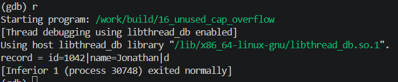

<!-- generated from vault: 16_unused_cap_overflow 코드 분석.md — 편집은 Obsidian에서 -->
---
분류: 코드 분석
버그유형: 스택 버퍼 오버플로 (cap 인자를 받고도 경계 검사에 안 씀)
언어: C
출처: debugging_lab_docker/challenges/16_unused_cap_overflow/bug.c
날짜: 2026-09-23
---

# 16_unused_cap_overflow

한 줄 시나리오: 여러 필드를 구분자로 이어 붙여 한 줄의 레코드를 스택 버퍼에 만든다. append_field() 는 대상 버퍼와 그 용량(cap)을 받아 필드를 덧붙이는 헬퍼처럼 보인다.

> 기대 동작: cap 을 지켜 필드를 이어 붙이고 정상 종료. 전체 레코드는 NUL 포함 61바이트라 rec[24] 에 들어가지 않는다. 넘치면 잘라 담거나(truncate) 오류로 처리하고, 전체 문자열을 출력하려면 버퍼를 키운다.


## 함수

### 핵심 로직
```C
static void append_field(char *buf, size_t cap, size_t *len, const char *field, char sep) {
    if (*len > 0) {
        buf[(*len)++] = sep;
    }
    size_t flen = strlen(field);
    for (size_t i = 0; i < flen; i++) {
        buf[(*len)++] = field[i];
    }
    buf[*len] = '\0';
    (void)cap;
}
```
- `static void append_field(char *buf, size_t cap, size_t *len, const char *field, char sep)` - 받아온 `buf`에 `field`를 추가하는 함수
	- `cap`을 인자로 받지만 `(void)cap;`으로 버려서 경계 검사에 쓰지 않음 (함정)

### 기타 (재현 장치·유틸)
```C
static void build_record(char *rec, size_t cap) {
    const char *fields[] = {
        "id=1042", "name=Jonathan", "department=Engineering", "role=maintainer",
    };
    int n = (int)(sizeof(fields) / sizeof(fields[0]));

    size_t len = 0;
    rec[0] = '\0';
    for (int i = 0; i < n; i++) {
        append_field(rec, cap, &len, fields[i], '|');
    }
}
```

### 메인 함수
```C
int main(void) {
    char rec[24];

    build_record(rec, sizeof rec);

    printf("record = %s\n", rec);
    return 0;
}
```

실행 흐름
1. `rec[24]` 선언 및 `build_record` 실행
2. `append_field`가 필드를 이어 붙임 **← 원인 지점**: `cap`을 받고도 `(void)cap`으로 버려 경계 검사 없이 계속 씀
3. 세 번째 필드("department=Engineering")에서 `*len`이 24를 크게 넘김 **← 오염/전파 지점**: `rec[24]` 밖(스택 카나리 자리)까지 씀
4. `main` 반환 시 카나리 검사 **← 실제 크래시 지점**: 훼손 감지 → `*** stack smashing detected ***` → SIGABRT


## gdb로 잡기

빌드: `make gdb NAME=` (= `gdb ./build/`)

### 1) 죽은 자리 — `run` → `bt`
```
(gdb) run
*** stack smashing detected ***: terminated

Program received signal SIGABRT, Aborted.
0x00007ffff7e43c0c in pthread_kill () from /lib/x86_64-linux-gnu/libc.so.6
(gdb) bt
#0  0x00007ffff7e43c0c in pthread_kill () from /lib/x86_64-linux-gnu/libc.so.6
#1  0x00007ffff7dea27e in raise () from /lib/x86_64-linux-gnu/libc.so.6
#2  0x00007ffff7dcd8ff in abort () from /lib/x86_64-linux-gnu/libc.so.6
#3  0x00007ffff7dce7b6 in ?? () from /lib/x86_64-linux-gnu/libc.so.6
#4  0x00007ffff7edbea9 in __fortify_fail () from /lib/x86_64-linux-gnu/libc.so.6
#5  0x00007ffff7edd134 in __stack_chk_fail () from /lib/x86_64-linux-gnu/libc.so.6
#6  0x0000555555555352 in main () at challenges/16_unused_cap_overflow/bug.c:75
```
stack smashing detected - 스택이 허용된 범위 밖으로 나갔다 (스택 버퍼 오버플로우). `__stack_chk_fail`이 카나리 훼손을 감지하고 abort. 크래시는 main 반환 시점(#6)이지만 원인은 그 전에 넘겨 쓴 것.

### 2) 어떤 데이터인지 — `print`, `print *`, `info locals`
```
(gdb) f 6
#6  0x0000555555555352 in main () at challenges/16_unused_cap_overflow/bug.c:75
75      }
(gdb) info locals
rec = "id=1042|name=Jonathan|de"
```
출력은 전체가 다 나왔는데(`printf`는 넘겨 쓴 뒤 실행됨) `rec`에 남은 값은 24바이트로 잘려 있다 — 그 뒤로 카나리·스택을 덮은 상태.

### 3) 누가 언제 그렇게 만들었는지 — `break`, `watch`
```
Breakpoint 1, append_field (buf=... "id=1042", cap=24, len=..., field="name=Jonathan", ...)
1: buf = "id=1042"
2: *len = 7

(gdb) c
Breakpoint 1, append_field (buf=... "id=1042|name=Jonathan", cap=24, ...)
2: *len = 21

(gdb) c
Breakpoint 1, append_field (buf=... "id=1042|name=Jonathan|department=Engineering", cap=24, ...)
2: *len = 44          ← cap(24)을 이미 크게 넘김

(gdb) c
record = id=1042|name=Jonathan|department=Engineering|role=maintainer
*** stack smashing detected ***: terminated
```
`cap=24`인데 `*len`이 21 → 44로 커지도록 아무도 막지 않는다. `cap`을 받기만 하고 검사에 안 쓴 결과.

### 정리
| 단계 | 함수 | 무슨 일 |
|---|---|---|
| 원인 | `append_field` | `cap`을 받고도 `(void)cap`으로 버려 경계 검사를 안 함 |
| 전파 | `append_field` (`buf[(*len)++]=...`) | `*len`이 cap(24)을 넘어서도 계속 써서 `rec[24]` 밖 카나리까지 덮음 |
| 증상 | `main` 반환 (`__stack_chk_fail`) | 카나리 훼손 감지 → stack smashing detected → SIGABRT |


## 문제
- `buf`의 크기보다 더 많은 데이터를 작성하고 있다.
- `cap`이 제대로 기능하지 않고 있다 (`(void)cap`으로 버려짐).

**결론 한 문장:** `cap`을 사용해서 범위를 넘어가는 데이터들에 대한 처리를 해야한다.


## 수정
- 왜 이 위치에서 고치는가 (책임/소유권): `append_field`가 `cap`을 인자로 받으니 `cap`을 사용해서 넣을 수 있는지 판단하는 책임을 진다.
- 무엇을 바꾸는가: 작성할 수 있는 크기 판단 추가 (넘치면 truncate), `(void)cap` 삭제
	```C
	size_t flen = strlen(field);
	int extra = *len > 0 ? 1 : 0;           // 구분자 자리

	if (*len + flen + extra + 1 > cap) {    // +1 은 NUL 자리
	    int remain = (int)cap - (int)*len - extra - 1;
	    if (remain < 0) return;
	    flen = remain > 0 ? (size_t)remain : 0;
	}
	```

정답 코드
```C
#include <stdio.h>
#include <string.h>


static void append_field(char *buf, size_t cap, size_t *len, const char *field, char sep) {
    // 작성할 수 있는 크기 판단
    size_t flen = strlen(field);
    int extra = *len > 0 ? 1 : 0;

    if (*len + flen + extra + 1 > cap) {           // 원래 없었음: +1 은 NUL
        int remain = (int)cap - (int)*len - extra - 1;
        if (remain < 0) return;
        flen = remain > 0 ? (size_t)remain : 0;
    }

    // 실제 데이터 작성
    if (*len > 0) {
        buf[(*len)++] = sep;
    }
    for (size_t i = 0; i < flen; i++) {
        buf[(*len)++] = field[i];
    }
    buf[*len] = '\0';
    // (void)cap;   원래 있던 줄 — cap을 실제로 쓰게 되어 삭제
}

static void build_record(char *rec, size_t cap) {
    const char *fields[] = {
        "id=1042", "name=Jonathan", "department=Engineering", "role=maintainer",
    };
    int n = (int)(sizeof(fields) / sizeof(fields[0]));

    size_t len = 0;
    rec[0] = '\0';
    for (int i = 0; i < n; i++) {
        append_field(rec, cap, &len, fields[i], '|');
    }
}

int main(void) {
    char rec[24];

    build_record(rec, sizeof rec);

    printf("record = %s\n", rec);
    return 0;
}
```

검증: 종료 코드 0 · `record = id=1042|name=Jonathan|d` (23글자 + NUL = 24) · valgrind clean · ASan clean · -fstack-protector-all 통과



---
<!-- 📋 사용법
     - 맨 위 "기대 동작"은 코드를 읽기 전에 문제 설명에서 옮겨 적는다. 수정 후 검증의 기준이 된다
     - 증상·원인은 풀고 난 뒤 "정리" 표와 "문제"에 쓴다 (풀기 전에 쓰면 힌트가 됨)
     - "증상"과 "원인"의 위치가 다르면 실행 흐름에 둘 다 표시한다 (이게 핵심)
     - gdb 출력은 실제로 찍은 걸 붙이고, 각 블록 아래에 "이 값이 왜 이상한지" 한 줄
     - 정답 코드에서 바꾼 줄에는 // 원래 없었음 / // ← 이유 를 남긴다
     - 검증은 크래시 안 남 + 기대 출력 + valgrind 세 가지를 다 적는다
     - 관련 노트: GDB Cheat Sheet · 02_stack_buffer_overflow 코드 분석
-->
