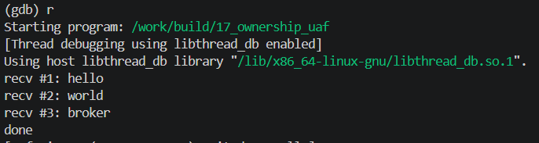

<!-- generated from vault: 17_ownership_uaf 코드 분석.md — 편집은 Obsidian에서 -->
---
분류: 코드 분석
버그유형: 소유권 이중화 → Use-After-Free / double free
언어: C
출처: debugging_lab_docker/challenges/17_ownership_uaf/bug.c
날짜: 2026-09-24
---

# 17_ownership_uaf 코드 분석

한 줄 시나리오: 간단한 발행/구독 브로커. 발행된 메시지(Msg: 힙에 복사된 body)를 인박스 큐에 넣고, deliver() 가 하나씩 꺼내 구독자 콜백에 넘긴다. 구독자는 메시지를 처리하고 나서 "소비했으니" free 한다. 브로커는 감사(audit)를 위해 발행 시점에 같은 Msg 포인터를 `log[]` 에도 담아둔다.

> 기대 동작: 모든 메시지를 배달·소비하고, 브로커를 종료하며 누수 없이 정리한 뒤 정상 종료.


## 구조체

### `Msg`
```C
typedef struct {
    int   id;
    char *body;      /* 힙 문자열 */
} Msg;
```
- `int id` - 메세지의 아이디
- `char *body` - 메세지 내용

### `Broker`
```C
#define QCAP 16

typedef struct {
    Msg *inbox[QCAP];   int head, tail;      /* 원형 큐 */
    Msg *log[QCAP];     int log_n;            /* 감사용: 같은 Msg 포인터를 보관 */
} Broker;
```
- `Msg *inbox[QCAP]` - 메세지를 저장할 원형 큐
- `Msg *log[QCAP]` - 메세지 로그를 저장하는 배열 (inbox와 **같은 Msg**를 가리킴)


## 함수

### `Msg` 동작
```C
static Msg *msg_new(int id, const char *body) {
    Msg *m = malloc(sizeof *m);
    if (!m) exit(1);
    m->id = id;
    m->body = malloc(strlen(body) + 1);
    if (!m->body) exit(1);
    strcpy(m->body, body);
    return m;
}

static void msg_free(Msg *m) {
    free(m->body);
    free(m);
}
```
- `static Msg *msg_new(int id, const char *body)` - 새로운 메세지 메모리 할당
- `static void msg_free(Msg *m)` - 메세지 메모리 해제

### `Broker` 동작
```C
static void publish(Broker *b, int id, const char *body) {
    Msg *m = msg_new(id, body);
    b->inbox[b->tail] = m;
    b->tail = (b->tail + 1) % QCAP;
    b->log[b->log_n++] = m;
}

static void deliver(Broker *b, Subscriber sub) {
    while (b->head != b->tail) {
        Msg *m = b->inbox[b->head];
        b->head = (b->head + 1) % QCAP;
        sub(m);
    }
}

static void broker_shutdown(Broker *b) {
    for (int i = 0; i < b->log_n; i++) {
        msg_free(b->log[i]);
    }
    b->log_n = 0;
}
```
- `static void publish(Broker *b, int id, const char *body)` - 새로운 메세지를 만들고 원형 큐에 해당 메세지 추가 및 로그에 저장
- `static void deliver(Broker *b, Subscriber sub)` - 모든 메세지 출력
- `static void broker_shutdown(Broker *b)` - 모든 메세지 메모리 해제

### 핵심 함수
```C
typedef void (*Subscriber)(Msg *m);

static void on_message(Msg *m) {
    printf("recv #%d: %s\n", m->id, m->body);
    msg_free(m);
}
```

### 메인 함수
```C
int main(void) {
    Broker b = { .head = 0, .tail = 0, .log_n = 0 };

    publish(&b, 1, "hello");
    publish(&b, 2, "world");
    publish(&b, 3, "broker");

    deliver(&b, on_message);

    broker_shutdown(&b);
    printf("done\n");
    return 0;
}
```

실행 흐름
1. `Broker b` 선언 및 초기화, 메세지들 추가
2. `deliver(&b, on_message)`로 모든 메세지 출력
3. `sub(m)`이 `on_message()`를 실행 **← 원인 지점**: 메세지 출력 후, 해당 메세지 메모리 해제
4. `broker_shutdown(&b)`로 `b`해제 **← 오염/전파 지점**: 로그에 저장되어있는 이미 해제된 메세지 다시 해제
5. `msg_free()` **← 실제 크래시 지점**: SIGSEGV


## gdb로 잡기

빌드: `make gdb NAME=` (= `gdb ./build/`)

### 1) 죽은 자리 — `run` → `bt`
```
(gdb) r
Starting program: /work/build/17_ownership_uaf
recv #1: hello
recv #2: world
recv #3: broker

Program received signal SIGSEGV, Segmentation fault.
0x00007ffff7e52e55 in free () from /lib/x86_64-linux-gnu/libc.so.6
(gdb) bt
#0  0x00007ffff7e52e55 in free () from /lib/x86_64-linux-gnu/libc.so.6
#1  0x00005555555552db in msg_free (m=0x5555555592a0)
    at challenges/17_ownership_uaf/bug.c:71
#2  0x0000555555555477 in broker_shutdown (b=0x7fffffffdd40)
    at challenges/17_ownership_uaf/bug.c:97
#3  0x0000555555555549 in main () at challenges/17_ownership_uaf/bug.c:111
```
`broker_shutdown`에서 로그의 메세지를 해제하다가 SIGSEGV

### 2) 어떤 데이터인지 — `print`, `print *`, `info locals`
```
(gdb) f 3
#3  0x0000555555555549 in main () at challenges/17_ownership_uaf/bug.c:111
111         broker_shutdown(&b);
(gdb) info locals
b = {inbox = {0x5555555592a0, 0x5555555592e0, 0x555555559320,
    0x0 <repeats 13 times>}, head = 3, tail = 3, log = {0x5555555592a0,
    0x5555555592e0, 0x555555559320, 0x0 <repeats 13 times>}, log_n = 3}
(gdb) print b->log[0]
$3 = (Msg *) 0x5555555592a0
(gdb) print b->log[0]->body
$4 = 0xe08e317126cb6968 <error: Cannot access memory at address 0xe08e317126cb6968>
```
로그에 있는 메세지의 내용에 접근할 수 없다. (`inbox`와 `log`가 같은 주소를 가리킴 — 이미 `on_message`에서 해제된 Msg라 `body` 자리가 할당기 메타데이터로 덮여 쓰레기 주소가 됨)

### 3) 누가 언제 그렇게 만들었는지 — `break`, `watch`
```
(gdb) break on_message
(gdb) run

Breakpoint 1, on_message (m=0x5555555592a0) at challenges/17_ownership_uaf/bug.c:91
91          printf("recv #%d: %s\n", m->id, m->body);
(gdb) n
recv #1: hello
92          msg_free(m);
(gdb) n
93      }
(gdb) print m
$5 = (Msg *) 0x5555555592a0

(gdb) c
Breakpoint 1, on_message (m=0x5555555592e0) at challenges/17_ownership_uaf/bug.c:91
91          printf("recv #%d: %s\n", m->id, m->body);
(gdb) n
recv #2: world
92          msg_free(m);
(gdb) n
93      }
(gdb) print m
$6 = (Msg *) 0x5555555592e0

(gdb) c
Continuing.

Breakpoint 1, on_message (m=0x555555559320) at challenges/17_ownership_uaf/bug.c:91
91          printf("recv #%d: %s\n", m->id, m->body);
(gdb) n
recv #3: broker
92          msg_free(m);
(gdb) n
93      }
(gdb) print m
$7 = (Msg *) 0x555555559320
```
`on_message`가 메세지를 출력하고 해당 메세지의 메모리를 해제. 해제된 주소(`…92a0`, `…92e0`, `…9320`)가 `log[]`에 그대로 남아 있음.

### 정리
| 단계 | 함수 | 무슨 일 |
|---|---|---|
| 원인 | `on_message` | 소비자가 `msg_free(m)` — 브로커도 `log[]`로 같은 Msg를 해제하는데, 소유권이 두 곳에 있음 |
| 전파 | `msg_free` (on_message 안) | Msg 해제 후 청크의 `body` 자리가 할당기 메타데이터로 덮이고, `log[]`는 dangling |
| 증상 | `broker_shutdown` → `msg_free` → `free` | 해제된 Msg의 쓰레기 `body`를 다시 free → SIGSEGV (double free) |


## 문제
- `on_message`에서 메모리를 해제해버린다.
- `log[]`도 같은 Msg를 들고 있어서, `broker_shutdown`에서 한 번 더 해제한다.

**결론 한 문장:** 출력을 담당하는 함수인 `on_message`에서 `msg_free(m)`을 삭제 — 소유권은 브로커 한 곳만.


## 수정
- 왜 이 위치에서 고치는가 (책임/소유권): `on_message` - 출력만 담당. 해제 책임은 `log[]`로 모든 Msg를 추적하는 브로커(`broker_shutdown`)가 한 번만 진다.
- 무엇을 바꾸는가: `msg_free(m)` 삭제


정답 코드
```C
#include <stdio.h>
#include <stdlib.h>
#include <string.h>

typedef struct {
    int   id;
    char *body;      /* 힙 문자열 */
} Msg;

#define QCAP 16
typedef struct {
    Msg *inbox[QCAP];   int head, tail;      /* 원형 큐 */
    Msg *log[QCAP];     int log_n;            /* 감사용: 같은 Msg 포인터를 보관 */
} Broker;

typedef void (*Subscriber)(Msg *m);

static Msg *msg_new(int id, const char *body) {
    Msg *m = malloc(sizeof *m);
    if (!m) exit(1);
    m->id = id;
    m->body = malloc(strlen(body) + 1);
    if (!m->body) exit(1);
    strcpy(m->body, body);
    return m;
}

static void msg_free(Msg *m) {
    free(m->body);
    free(m);
}

static void publish(Broker *b, int id, const char *body) {
    Msg *m = msg_new(id, body);
    b->inbox[b->tail] = m;
    b->tail = (b->tail + 1) % QCAP;
    b->log[b->log_n++] = m;
}

static void deliver(Broker *b, Subscriber sub) {
    while (b->head != b->tail) {
        Msg *m = b->inbox[b->head];
        b->head = (b->head + 1) % QCAP;
        sub(m);
    }
}

static void on_message(Msg *m) {
    printf("recv #%d: %s\n", m->id, m->body);
    // msg_free(m);             // 삭제: 소비자는 읽기만, 해제는 브로커가
}

static void broker_shutdown(Broker *b) {
    for (int i = 0; i < b->log_n; i++) {
        msg_free(b->log[i]);
    }
    b->log_n = 0;
}

int main(void) {
    Broker b = { .head = 0, .tail = 0, .log_n = 0 };

    publish(&b, 1, "hello");
    publish(&b, 2, "world");
    publish(&b, 3, "broker");

    deliver(&b, on_message);

    broker_shutdown(&b);
    printf("done\n");
    return 0;
}
```

검증: 종료 코드 0 · `recv #1: hello` / `recv #2: world` / `recv #3: broker` / `done` · valgrind clean · ASan clean



---
<!-- 📋 사용법
     - 맨 위 "기대 동작"은 코드를 읽기 전에 문제 설명에서 옮겨 적는다. 수정 후 검증의 기준이 된다
     - 증상·원인은 풀고 난 뒤 "정리" 표와 "문제"에 쓴다 (풀기 전에 쓰면 힌트가 됨)
     - "증상"과 "원인"의 위치가 다르면 실행 흐름에 둘 다 표시한다 (이게 핵심)
     - gdb 출력은 실제로 찍은 걸 붙이고, 각 블록 아래에 "이 값이 왜 이상한지" 한 줄
     - 정답 코드에서 바꾼 줄에는 // 원래 없었음 / // ← 이유 를 남긴다
     - 검증은 크래시 안 남 + 기대 출력 + valgrind 세 가지를 다 적는다
     - 관련 노트: GDB Cheat Sheet
-->
