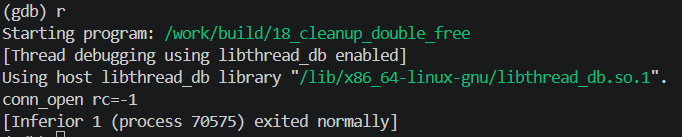

<!-- generated from vault: 18_cleanup_double_free 코드 분석.md — 편집은 Obsidian에서 -->
---
분류: 코드 분석
버그유형: goto 정리 경로의 double free (+ state 누수)
언어: C
출처: debugging_lab_docker/challenges/18_cleanup_double_free/bug.c
날짜: 2026-09-24
---

# 18_cleanup_double_free

한 줄 시나리오: 연결(Conn)을 열며 여러 자원을 순서대로 확보한다: 수신 버퍼(rx) → 송신 버퍼(tx) → 세션 상태(state). 확보 도중 실패하면 goto 라벨 사다리로 "역순 정리"한다. 마지막에 핸드셰이크 검증을 수행하고, 실패하면 역시 정리 경로로 빠진다.

> 기대 동작: 각 자원을 확보한 만큼만, 정확히 한 번씩 해제하고 실패 코드를 반환.


## 구조체

### `Conn`
```C
typedef struct {
    char *rx;
    char *tx;
    int  *state;
} Conn;
```
- `char *rx` - 수신 버퍼
- `char *tx` - 송신 버퍼
- `int *state` - 세션 상태


## 함수

### 핵심 로직
```C
static int conn_open(Conn *c, size_t bufsz) {
    c->rx = c->tx = NULL;
    c->state = NULL;

    c->rx = malloc(bufsz);
    if (!c->rx) goto fail_rx;

    c->tx = malloc(bufsz);
    if (!c->tx) goto fail_tx;

    c->state = malloc(sizeof(int) * 4);
    if (!c->state) goto fail_state;

    strcpy(c->rx, "rx-ready");
    strcpy(c->tx, "tx-ready");
    for (int i = 0; i < 4; i++) c->state[i] = i;

    if (!handshake_ok(c)) {
        free(c->tx);
        goto fail_tx;
    }

    return 0;

fail_state:
    free(c->state);
fail_tx:
    free(c->tx);
fail_rx:
    free(c->rx);
    return -1;
}
```
- `static int conn_open(Conn *c, size_t bufsz)` - 연결 시작
	- 각 버퍼들 메모리 할당
	- 실패시 역순 메모리 해제 (라벨 사다리: 점프한 라벨부터 아래로 전부 해제)

### 기타 (재현 장치·유틸)
```C
static int handshake_ok(const Conn *c) {
    (void)c;
    return 0;                     /* 실패 */
}
```
- `static int handshake_ok(const Conn *c)` - 연결 준비 완료 되었는지 판단
	- 항상 0(실패)을 반환해서, 자원을 다 확보한 뒤의 실패 정리 경로를 매번 타게 만드는 재현 장치

### 메인 함수
```C
int main(void) {
    Conn c;
    int rc = conn_open(&c, 32);
    printf("conn_open rc=%d\n", rc);
    return 0;
}
```

실행 흐름
1. `Conn c` 선언 및 연결 시작 (rx, tx, state 모두 확보)
2. `handshake_ok` 실패 **← 원인 지점**: 송신 버퍼를 따로 `free`한 뒤 `goto fail_tx` — `fail_state`를 건너뜀 (state 누수)
3. `fail_tx` 라벨로 이동 후, `free(c->tx)` 실행 **← 실제 크래시 지점**: 해제한 송신 버퍼를 다시 해제 → glibc `double free detected` → SIGABRT


## gdb로 잡기

빌드: `make gdb NAME=` (= `gdb ./build/`)

### 1) 죽은 자리 — `run` → `bt`
```
(gdb) run
Program received signal SIGABRT, Aborted.
0x00007ffff7e43c0c in pthread_kill () from /lib/x86_64-linux-gnu/libc.so.6

(gdb) bt
#0  0x00007ffff7e43c0c in pthread_kill () from /lib/x86_64-linux-gnu/libc.so.6
#1  0x00007ffff7dea27e in raise () from /lib/x86_64-linux-gnu/libc.so.6
#2  0x00007ffff7dcd8ff in abort () from /lib/x86_64-linux-gnu/libc.so.6
#3  0x00007ffff7dce7b6 in ?? () from /lib/x86_64-linux-gnu/libc.so.6
#4  0x00007ffff7e4e0d5 in ?? () from /lib/x86_64-linux-gnu/libc.so.6
#5  0x00007ffff7e5063f in ?? () from /lib/x86_64-linux-gnu/libc.so.6
#6  0x00007ffff7e52eae in free () from /lib/x86_64-linux-gnu/libc.so.6
#7  0x0000555555555316 in conn_open (c=0x7fffffffde20, bufsz=32)
    at challenges/18_cleanup_double_free/bug.c:84
#8  0x000055555555535b in main () at challenges/18_cleanup_double_free/bug.c:92
```
`conn_open`에서 SIGABRT 발생 (84행 = `fail_tx: free(c->tx)`)

### 2) 어떤 데이터인지 — `print`, `print *`, `info locals`
```
(gdb) p c
$1 = (Conn *) 0x7fffffffde20
(gdb) p c->rx
$2 = 0x5555555592a0 "rx-ready"
(gdb) p c->tx
$3 = 0x5555555592d0 "YUUU\005"
```
`c->tx`가 이미 해제되어 있다. (`rx`는 "rx-ready"로 멀쩡한데 `tx`는 내용이 할당기 메타데이터로 바뀜)

### 3) 누가 언제 그렇게 만들었는지 — `break`, `watch`
```
(gdb) break 73
(gdb) run

Breakpoint 1, conn_open (c=0x7fffffffde20, bufsz=32)
    at challenges/18_cleanup_double_free/bug.c:73
73          if (!handshake_ok(c)) {
(gdb) print c->tx
$4 = 0x5555555592d0 "tx-ready"
(gdb) n
75              free(c->tx);
(gdb) n
76              goto fail_tx;
(gdb) print c->tx
$5 = 0x5555555592d0 "YUUU\005"
```
`handshake_ok`가 실패하면 송신 버퍼 해제. 같은 주소(`…92d0`)가 `fail_tx`에서 한 번 더 해제된다.

### 정리
| 단계 | 함수 | 무슨 일 |
|---|---|---|
| 원인 | `conn_open` (handshake 실패 분기) | 정리 사다리 밖에서 `tx`를 따로 free하고 `goto fail_tx` — 해제 책임이 두 곳 |
| 전파 | `goto fail_tx` | `fail_state`를 건너뛰어 `state` 누수, 이미 해제된 `tx`로 라벨 진입 |
| 증상 | `fail_tx: free(c->tx)` | 같은 포인터 이중 해제 → glibc `double free detected` → SIGABRT |


## 문제
- `handshake_ok`가 실패하면 송신 버퍼를 해제하고 `fail_tx`라벨로 `goto`, 이미 해제된 송신 버퍼를 다시 해제
- `fail_tx`로 들어가면서 `fail_state`를 건너뛰어 `state`는 해제되지 않음 (누수)

**결론 한 문장:** `handshake_ok` 실패 시 따로 해제하지 말고, 모든 자원을 정리하는 라벨(`fail_state`)로 보낸다 — 해제 책임은 정리 사다리 한 곳에만.


## 수정
- 왜 이 위치에서 고치는가 (책임/소유권): `handshake_ok`가 실패하면 가지고 있던 모든 자원을 반납해야 하기 때문에. 라벨 사다리가 "여기로 점프하면 이 자원부터 역순으로 전부 정리"를 보장하니, 따로 해제하지 않고 맞는 라벨로 점프만 한다.
- 무엇을 바꾸는가: `free(c->tx)` 삭제, `goto` 라벨을 `fail_state`로 변경


정답 코드
```C
#include <stdio.h>
#include <stdlib.h>
#include <string.h>

typedef struct {
    char *rx;
    char *tx;
    int  *state;
} Conn;

static int handshake_ok(const Conn *c) {
    (void)c;
    return 0;                     /* 실패 */
}

static int conn_open(Conn *c, size_t bufsz) {
    c->rx = c->tx = NULL;
    c->state = NULL;

    c->rx = malloc(bufsz);
    if (!c->rx) goto fail_rx;

    c->tx = malloc(bufsz);
    if (!c->tx) goto fail_tx;

    c->state = malloc(sizeof(int) * 4);
    if (!c->state) goto fail_state;

    strcpy(c->rx, "rx-ready");
    strcpy(c->tx, "tx-ready");
    for (int i = 0; i < 4; i++) c->state[i] = i;

    if (!handshake_ok(c)) {
        // free(c->tx);             // 삭제: 따로 해제하면 fail_tx에서 double free
        // goto fail_tx;            // 삭제: fail_state를 건너뛰어 state 누수
        goto fail_state;            // 원래 없었음: 모든 자원을 역순 정리
    }

    return 0;

fail_state:
    free(c->state);
fail_tx:
    free(c->tx);
fail_rx:
    free(c->rx);
    return -1;
}

int main(void) {
    Conn c;
    int rc = conn_open(&c, 32);
    printf("conn_open rc=%d\n", rc);
    return 0;
}
```

검증: 종료 코드 0 · `conn_open rc=-1` · valgrind clean (double free·누수 없음) · ASan clean



---
<!-- 📋 사용법
     - 맨 위 "기대 동작"은 코드를 읽기 전에 문제 설명에서 옮겨 적는다. 수정 후 검증의 기준이 된다
     - 증상·원인은 풀고 난 뒤 "정리" 표와 "문제"에 쓴다 (풀기 전에 쓰면 힌트가 됨)
     - "증상"과 "원인"의 위치가 다르면 실행 흐름에 둘 다 표시한다 (이게 핵심)
     - gdb 출력은 실제로 찍은 걸 붙이고, 각 블록 아래에 "이 값이 왜 이상한지" 한 줄
     - 정답 코드에서 바꾼 줄에는 // 원래 없었음 / // ← 이유 를 남긴다
     - 검증은 크래시 안 남 + 기대 출력 + valgrind 세 가지를 다 적는다
     - 관련 노트: GDB Cheat Sheet
-->
