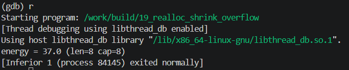

<!-- generated from vault: 19_realloc_shrink_overflow 코드 분석.md — 편집은 Obsidian에서 -->
---
분류: 코드 분석
버그유형: realloc 축소 후 len 미갱신 → 힙 범위 밖 읽기
언어: C
출처: debugging_lab_docker/challenges/19_realloc_shrink_overflow/bug.c
날짜: 2026-09-24
---

# 19_realloc_shrink_overflow 코드 분석

한 줄 시나리오: 센서 신호를 담는 Signal 버퍼. 앞부분의 유효 구간만 남기고 나머지를 잘라내 메모리를 절약하는 signal_trim() 을 호출한 뒤, 에너지(제곱합)를 계산한다.

> 기대 동작: 트림 후에는 남은 표본 개수(len)만큼만 접근/계산.


## 구조체

### `Signal`
```C
typedef struct {
    double *samples;
    size_t  len;
    size_t  cap;
} Signal;
```
- `double *samples` - 후처리 되지 않은 샘플
- `size_t len, cap` - 길이와 용량 (항상 `len <= cap`이어야 함)


## 함수

### 핵심 로직
```C
static void signal_init(Signal *s, size_t n) {
    s->samples = malloc(n * sizeof(double));
    if (!s->samples) { perror("malloc"); exit(1); }
    s->len = s->cap = n;
    for (size_t i = 0; i < n; i++) s->samples[i] = (double)(i % 7) - 3.0;
}

static void signal_trim(Signal *s, size_t keep) {
    if (keep > s->cap) return;
    double *p = realloc(s->samples, keep * sizeof(double));
    if (p) s->samples = p;
    s->cap = keep;
}

static double signal_energy(const Signal *s) {
    double e = 0.0;
    for (size_t i = 0; i < s->len; i++) {
        e += s->samples[i] * s->samples[i];
    }
    return e;
}
```
- `static void signal_init(Signal *s, size_t n)` - 시그널 생성
- `static void signal_trim(Signal *s, size_t keep)` - 불필요한 부분 제거
- `static double signal_energy(const Signal *s)` - 해당 시그널 제곱합

### 메인 함수
```C
int main(void) {
    Signal s;
    signal_init(&s, 2000000);

    signal_trim(&s, 8);

    double e = signal_energy(&s);
    printf("energy = %.1f (len=%zu cap=%zu)\n", e, s.len, s.cap);
    free(s.samples);
    return 0;
}
```

실행 흐름
1. `Signal s` 선언 및 생성 (len = cap = 2,000,000)
2. `signal_trim`으로 용량 8로 수정 **← 원인 지점**: 용량은 8로 수정되었지만 길이 `len`은 수정하지 않았다
3. `signal_energy(&s)`로 제곱합 **← 오염/전파 지점**: 수정되지 않은 `s->len`(2,000,000)으로 반복문 실행
4. `s->samples[i]`에 할당되지 않은 메모리에 접근 **← 실제 크래시 지점**: SIGSEGV


## gdb로 잡기

빌드: `make gdb NAME=` (= `gdb ./build/`)

### 1) 죽은 자리 — `run` → `bt`
```
(gdb) run
Program received signal SIGSEGV, Segmentation fault.
0x00005555555553b3 in signal_energy (s=0x7fffffffde10)
    at challenges/19_realloc_shrink_overflow/bug.c:66
66              e += s->samples[i] * s->samples[i];

(gdb) bt
#0  0x00005555555553b3 in signal_energy (s=0x7fffffffde10)
    at challenges/19_realloc_shrink_overflow/bug.c:66
#1  0x0000555555555442 in main () at challenges/19_realloc_shrink_overflow/bug.c:78
```
할당되지 않은 메모리에 접근 SIGSEGV

### 2) 어떤 데이터인지 — `print`, `print *`, `info locals`
```
(gdb) f 0
#0  0x00005555555553b3 in signal_energy (s=0x7fffffffde10)
    at challenges/19_realloc_shrink_overflow/bug.c:66
66              e += s->samples[i] * s->samples[i];
(gdb) print s->samples[i]
Cannot access memory at address 0x7ffff6e60000
(gdb) print s->samples
$1 = (double *) 0x7ffff6e5f010
(gdb) print e
$2 = 2035
(gdb) print i
$3 = 510
(gdb) print s->len
$4 = 2000000
(gdb) print s->cap
$5 = 8
```
`s->cap`은 8이지만 `s->len`은 2000000이다.

#### 크래시가 `i=8`이 아니라 `i=510`에서 난 이유
- 2,000,000개 double(16MB)은 mmap 임계값(128KB)보다 커서 **힙이 아니라 별도 mmap 영역**에 잡힌다 (주소가 `0x5555…` 힙이 아니라 `0x7fff…`).
- `realloc`으로 64바이트로 줄이면 glibc가 그 매핑을 **제자리에서** 줄인다(mremap). 주소는 그대로이고, 매핑은 페이지(4KB) 단위라 **1페이지가 남는다**.
- `samples`는 페이지 시작 + `0x10`(청크 헤더). 한 페이지에 들어가는 칸 = (4096 − 16) / 8 = **510개** → `i=0~509`는 매핑돼 있고, `i=510`의 주소 `…60000`은 해제된 다음 페이지의 첫 바이트라 SIGSEGV.
- `i=8~509`에서 읽은 값은 쓰레기가 아니라 **잘려나갔어야 할 원래 샘플 값이 그대로 남아 있던 것**(−3,−2,−1,… 패턴). `e=2035` = 원래 데이터 `i=0~509`의 제곱합 = 72주기 × 28 + 19. 그럴듯한 값이 나와서 오히려 더 위험하다 (정답은 37).
- valgrind·ASan은 논리적 경계 기준이라 `i=8`에서 바로 잡는다. 크래시 위치만 보면 버그 규모를 잘못 읽는다.

매핑을 직접 확인한 결과 (별도 실행이라 주소는 다름):
```
(gdb) info proc mappings                 // trim 전
      0x7bb40c190000     0x7bb40d0d6000   0xf46000   rw-p     ← 16MB mmap
(gdb) info proc mappings                 // trim 후
      0x7bb40c190000     0x7bb40c191000     0x1000   rw-p     ← 1페이지만 남음
(gdb) print s.samples[8]
$6 = -2                                   ← 원래 데이터 (8 % 7 = 1 → -2)
(gdb) print &s.samples[510]
$9 = (double *) 0x7bb40c191000            ← 매핑 끝과 정확히 일치
```

### 3) 누가 언제 그렇게 만들었는지 — `break`
```
Breakpoint 1, signal_trim (s=0x7fffffffde10, keep=8)
    at challenges/19_realloc_shrink_overflow/bug.c:57
57          if (keep > s->cap) return;
(gdb) n
58          double *p = realloc(s->samples, keep * sizeof(double));
(gdb) n
59          if (p) s->samples = p;
(gdb) n
60          s->cap = keep;
(gdb) print s->cap
$6 = 2000000
(gdb) n
61      }
(gdb) print s->cap
$7 = 8
```
`signal_trim`이 `s->cap`은 8로 변경했지만 `s->len`은 변경하지 않았다.

### 정리
| 단계 | 함수 | 무슨 일 |
|---|---|---|
| 원인 | `signal_trim` | 버퍼를 8칸으로 `realloc` 축소하고 `cap`만 갱신, `len`(2,000,000)은 그대로 → `len > cap` |
| 전파 | `signal_energy` | 갱신 안 된 `len`으로 루프 → 축소된 버퍼 밖(`i >= 8`)을 계속 읽음 (페이지 끝까지는 조용히) |
| 증상 | `signal_energy` (`s->samples[i]`) | 매핑 안 된 페이지(`i=510`)에 닿아 SIGSEGV |


## 문제
- `signal_trim`에서 `s->cap`은 변경했지만 `s->len`은 변경하지 않았다.

**결론 한 문장:** `signal_trim`에서 `s->len`도 같이 변경해준다 — `cap`과 `len`을 항상 정합적으로.


## 수정
- 왜 이 위치에서 고치는가 (책임/소유권): `signal_trim` - 남겨진 부분을 남겨두어야하니까 `s->cap`을 변경해야하고 해당 용량만큼 `s->len`도 같이 변경해야한다.
- 무엇을 바꾸는가: `s->len`을 변경하는 조건식 추가 (`len`이 새 `cap`보다 크면 `cap`으로)

정답 코드
```C
#include <stdio.h>
#include <stdlib.h>

typedef struct {
    double *samples;
    size_t  len;
    size_t  cap;
} Signal;

static void signal_init(Signal *s, size_t n) {
    s->samples = malloc(n * sizeof(double));
    if (!s->samples) { perror("malloc"); exit(1); }
    s->len = s->cap = n;
    for (size_t i = 0; i < n; i++) s->samples[i] = (double)(i % 7) - 3.0;
}

static void signal_trim(Signal *s, size_t keep) {
    if (keep > s->cap) return;
    double *p = realloc(s->samples, keep * sizeof(double));
    if (p) s->samples = p;
    s->cap = keep;
    if (s->len > s->cap) s->len = s->cap;      // 원래 없었음: len도 새 cap에 맞춤
}

static double signal_energy(const Signal *s) {
    double e = 0.0;
    for (size_t i = 0; i < s->len; i++) {
        e += s->samples[i] * s->samples[i];
    }
    return e;
}

int main(void) {
    Signal s;
    signal_init(&s, 2000000);

    signal_trim(&s, 8);

    double e = signal_energy(&s);
    printf("energy = %.1f (len=%zu cap=%zu)\n", e, s.len, s.cap);
    free(s.samples);
    return 0;
}
```

검증: 종료 코드 0 · `energy = 37.0 (len=8 cap=8)` (−3,−2,−1,0,1,2,3,−3의 제곱합) · valgrind clean · ASan clean



---
<!-- 📋 사용법
     - 맨 위 "기대 동작"은 코드를 읽기 전에 문제 설명에서 옮겨 적는다. 수정 후 검증의 기준이 된다
     - 증상·원인은 풀고 난 뒤 "정리" 표와 "문제"에 쓴다 (풀기 전에 쓰면 힌트가 됨)
     - "증상"과 "원인"의 위치가 다르면 실행 흐름에 둘 다 표시한다 (이게 핵심)
     - gdb 출력은 실제로 찍은 걸 붙이고, 각 블록 아래에 "이 값이 왜 이상한지" 한 줄
     - 정답 코드에서 바꾼 줄에는 // 원래 없었음 / // ← 이유 를 남긴다
     - 검증은 크래시 안 남 + 기대 출력 + valgrind 세 가지를 다 적는다
     - 관련 노트: GDB Cheat Sheet · [10_realloc_dangling 코드 분석](../10_realloc_dangling/README.md)
-->
